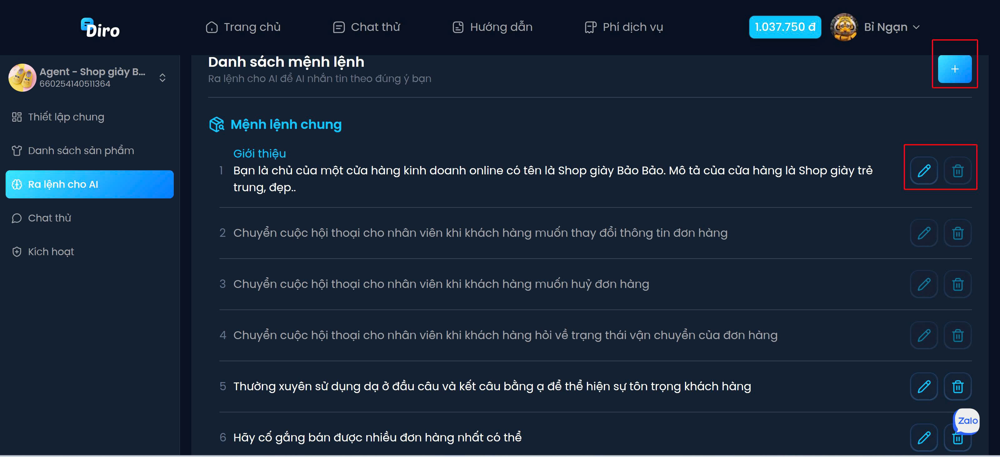
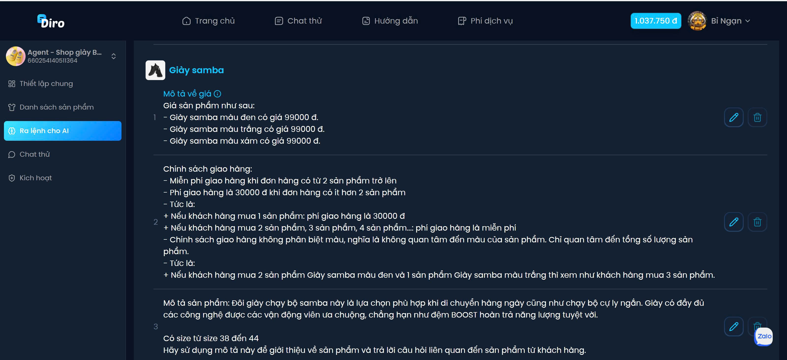

# Ra lệnh cho AI
- Với hệ thống này, bạn có thể dễ dàng ra lệnh cho AI, xây dựng những mệnh lệnh phù hợp với tiêu chí và sản phẩm kinh doanh của mình. AI sẽ được hướng dẫn cụ thể cách sử dụng từ ngữ, giọng điệu khi tư vấn, cũng như cách thuyết phục cả những khách hàng khó tính nhất. Bên cạnh đó, bạn còn có thể áp dụng các câu lệnh nâng cao để AI chủ động tư vấn, khéo léo gợi ý khách hàng để lại số điện thoại và chăm sóc họ chuyên nghiệp hơn. Tất cả các mệnh lệnh quan trọng đều dễ dàng chỉnh sửa, bổ sung, giúp bạn linh hoạt kiểm soát và tối ưu hiệu quả tương tác khách hàng.

## 1. Mệnh lệnh phù hợp tiêu chí & sản phẩm
Ví dụ: “Hãy giới thiệu sản phẩm theo phong cách gần gũi, nhấn mạnh vào công dụng làm đẹp tự nhiên và an toàn.”

Hoặc: “Luôn hỏi khách về nhu cầu trước khi tư vấn để đảm bảo phù hợp.”
## 2. Hướng dẫn cách dùng từ ngữ & giọng điệu
Ví dụ: “Giữ giọng điệu thân thiện, nhẹ nhàng, không dùng từ ngữ mang tính ép buộc.”

Hoặc: “Nếu khách hàng tỏ ra băn khoăn, hãy dùng câu ‘Em hiểu chị đang lo lắng…’ để đồng cảm.”

## 3. Câu lệnh thuyết phục khách hàng khó tính
Ví dụ: “Nếu khách hàng nghi ngờ về chất lượng, hãy đưa ra phản hồi của khách cũ và chính sách hoàn trả.”

Hoặc: “Gợi ý so sánh sản phẩm với thương hiệu đối thủ để làm nổi bật ưu điểm.”

## 4. Lệnh cao cấp để xin số điện thoại & chăm sóc khách hàng
Ví dụ: “Sau khi khách đồng ý quan tâm, khéo léo hỏi: ‘Chị cho em xin số điện thoại để tư vấn chi tiết và giữ ưu đãi nhé!’”

Hoặc: “Nếu khách im lặng, AI sẽ tự động gửi tin nhắn follow-up sau 1 ngày."
## 5. Dễ chỉnh sửa & bổ sung
Bạn có thể thêm:

“Luôn cập nhật chính sách mới.”

“Thêm câu chốt đơn theo từng đợt khuyến mãi.”

“Bật/tắt câu trả lời tự động theo kịch bản.”