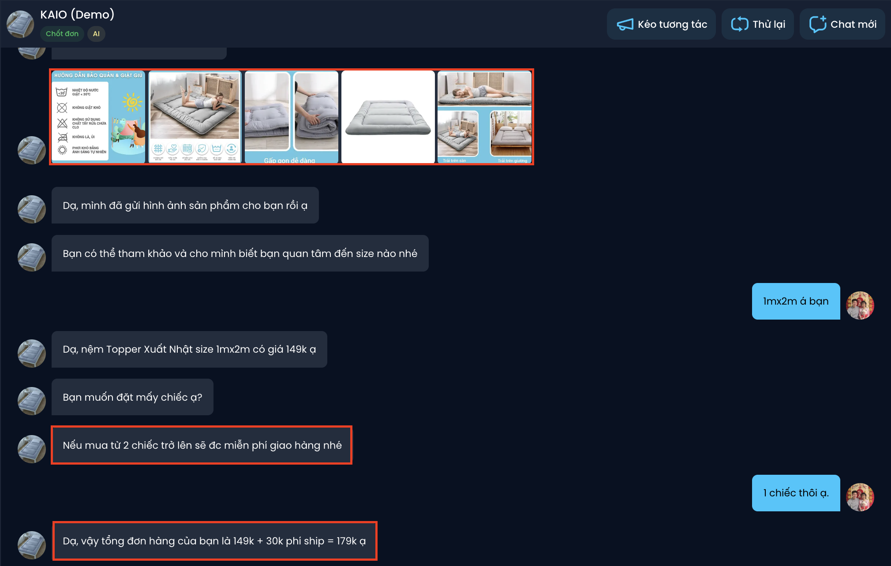
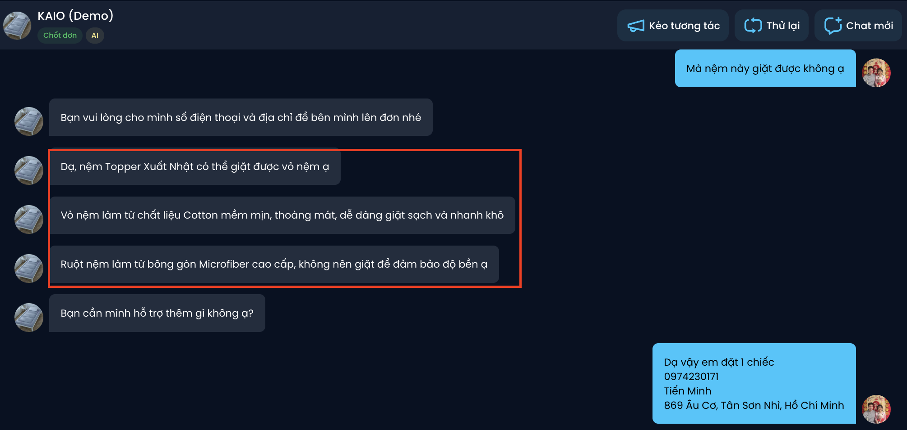
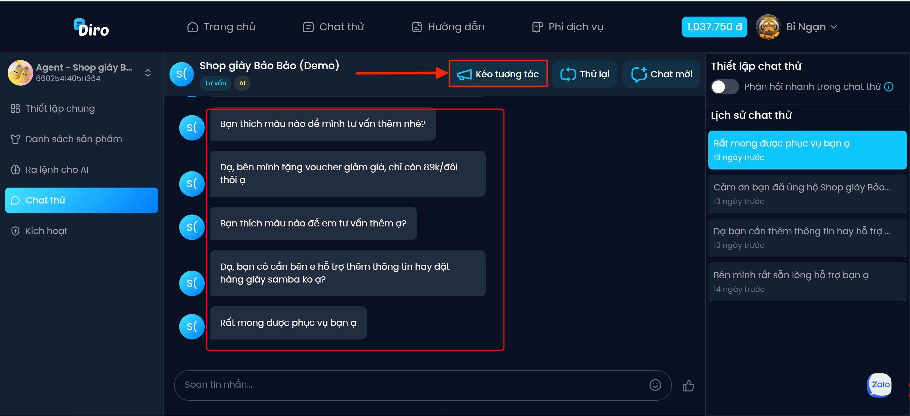
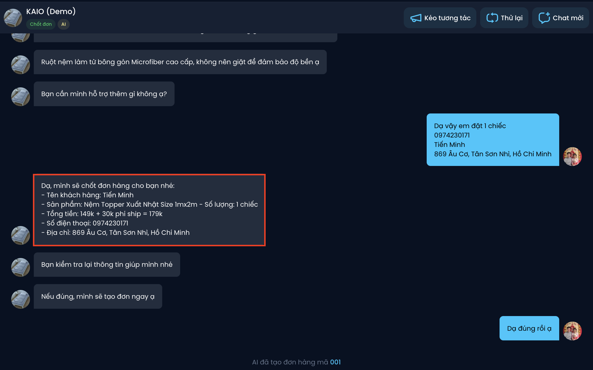

#  Chat thử với AI
Sau khi tạo xong AI Agent và thêm sản phẩm, bạn có kiểm tra hoạt động của AI để có thể thiết lập thêm các hành vi nâng cao để giúp AI phản hồi tự nhiên, chốt đơn thông minh và ứng biến tốt hơn trong nhiều tình huống.

Truy cập phần **“Chat thử”** và thực hiện thao tác nhắn tin như khách hàng để xem AI sẽ phản hồi thế nào.

### 1. Thử nghiệm yêu cầu các thông tin đã đã cài đặt
- **Kiểm tra đơn giá:** Đảm bảo AI tư vấn đúng giá theo từng biến thể đã thiết lập
- **Kiểm tra hình ảnh:** Đảm bảo AI gửi đúng ảnh/video minh họa phù hợp với sản phẩm
- **Giọng điệu & từ ngữ:** Bạn có thể điều chỉnh lại phong cách giao tiếp (thân thiện, lịch sự, chuyên nghiệp...) để phù hợp với thương hiệu tại “Ra lệnh cho AI”

### 2. Thử nghiệm yêu cầu các thông tin ngoài phạm vi đã cài đặt
- **Trường hợp AI có thể trả lời:** AI sẽ cố gắng tìm thông tin liên quan gần nhất trong mô tả sản phẩm hoặc hệ thống hoặc dựa vào kiến thức có sẵn của AI để trả lời phù hợp.  
*Ví dụ : AI chỉ được nhận thông tin Vỏ nệm làm Cotton và Ruột nệm làm từ bông gòn Microfiber, chưa được nhận thông tin về giặt sấy. Tuy nhiên, dựa vào kiến thức AI, AI vẫn trả lời được chính xác về vấn đề này.*

- **Trường hợp AI không thể trả lời:** AI chuyển tiếp cho nhân viên phụ trách xử lý khi câu hỏi vượt ngoài khả năng

**Bạn có thể huấn luyện AI những thông tin không được phép tự trả lời tại “Ra lệnh cho AI”*

### 3. Thử nghiệm kéo tương tác của AI khi không phản hồi
Sau khi cài đặt tính năng **“Kéo tương tác”** AI có thể tự động gửi lại tin nhắn hoặc giảm giá để kích thích khách hàng phản hồi nếu họ không phản hồi quá lâu (theo thời gian cài đặt)

- Chọn **“Kéo tương tác”** để bỏ qua thời gian cài đặt khách không phản hồi khi Chat thử với AI

### 4. Tự động chốt đơn – Quản lý đơn hàng
Khi khách đã đồng ý mua hàng, AI sẽ tự động:
- Xin **số điện thoại, địa chỉ**, và **số lượng sản phẩm**
- Tạo **đơn hàng ngay trong hệ thống**, liên kết với Danh sách sản phẩm đã thiết lập

