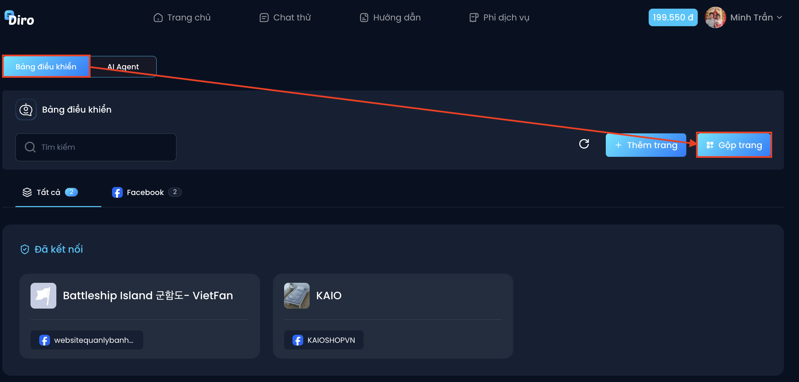
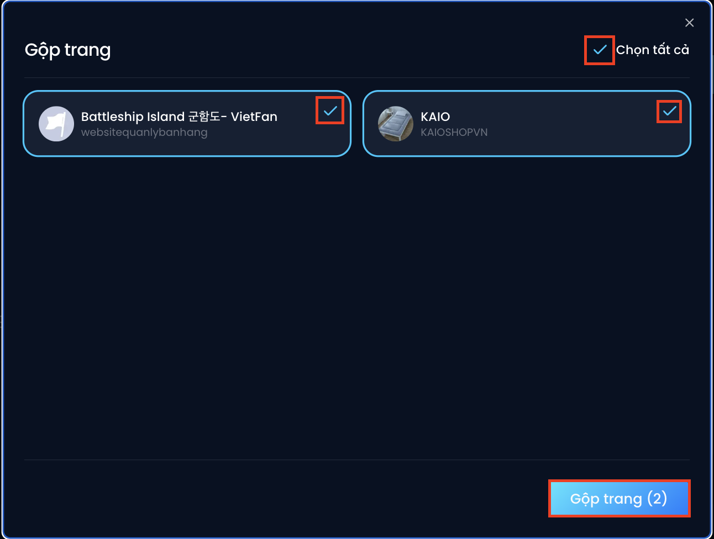

# Gộp chat nhiều Fanpage

Diro cho phép xem tin nhắn và đơn hàng của nhiều Fanpage cùng lúc, không phải kiểm tra từng trang một.

🔹 Bước 1: Vào **“Bảng điều khiển”** – nhấn nút **“Gộp chat”** ở góc trên bên phải

🔹 Bước 2: Tick chọn các Fanpage muốn gộp, hoặc nhấn **“Chọn tất cả”** – rồi nhấn **“Gộp chat”** để hoàn thành

:::note
Nút này trước đây tên là **“Gộp trang”**, nay đổi thành **“Gộp chat”**. Hai ảnh minh hoạ ở trên chụp từ phiên bản cũ nên vẫn hiện tên cũ; các bước thực hiện thì không đổi.
:::
