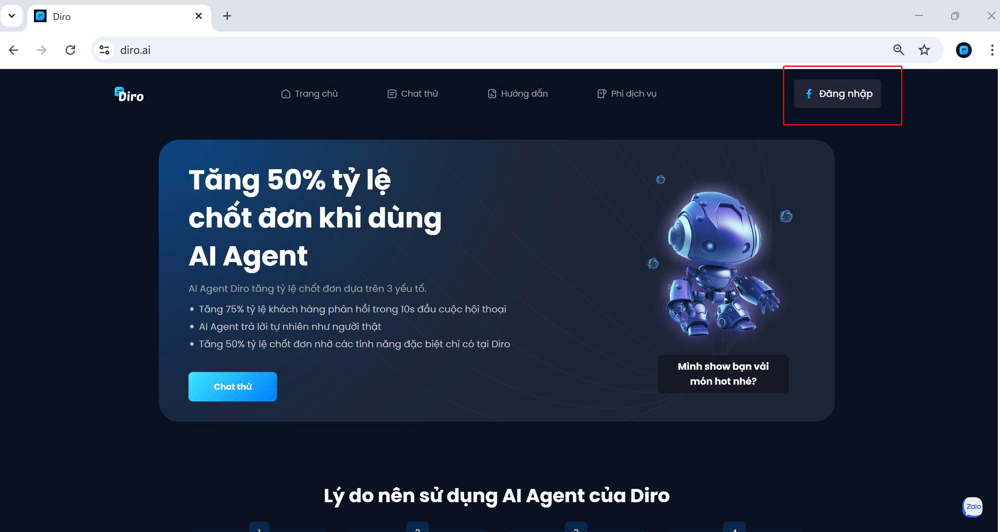
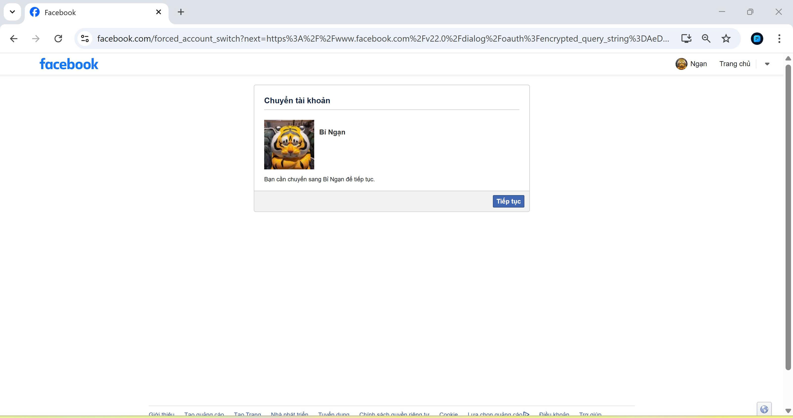
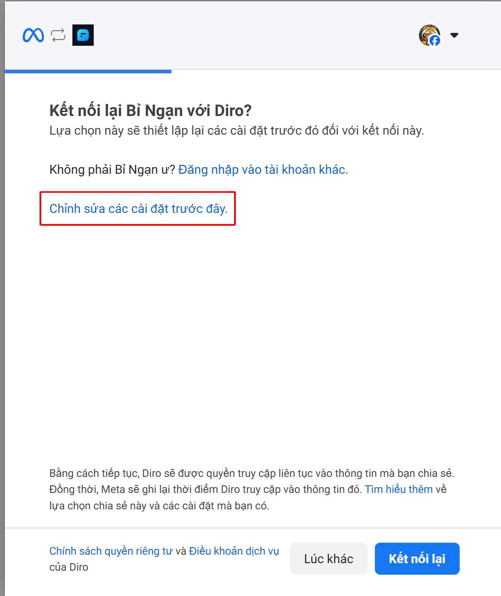
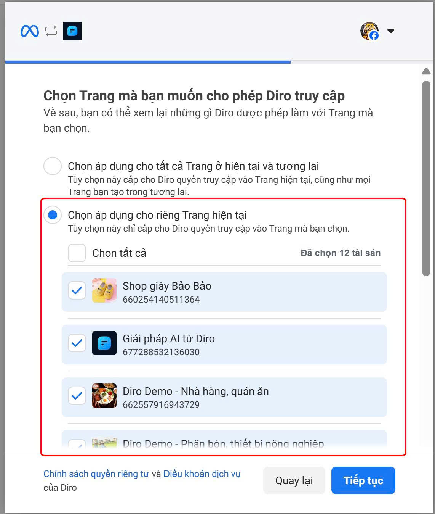

# HƯỚNG DẪN SỬ DỤNG DIRO 
# Kích hoạt bằng tài khoản Facebook 
- Bạn cần có các trang Facebook, có sẵn những Fanpage ,... mà bạn muốn kết nối với Diro . Tốt nhất bạn là quản trị viên của các trang này để quá trình kết nối diễn ra hiệu quả.
- Truy cập vào: https://diro.ai/ 
- Click chuột vào Ô đăng nhập bằng tài khoản facebook

- Click chuột vào **Tiếp tục**

- Chọn **Chỉnh sửa các cài đặt trước đây** để chọn Fanpage

- Chọn Fanpage bạn muốn Diro quản lý
Sau đó chọn **Tiếp tục** chọn **Lưu**

Tài khoản Facebook của bạn đã được liên kết với AI.