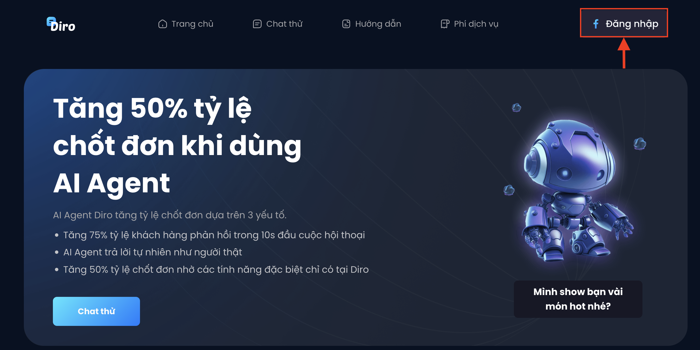
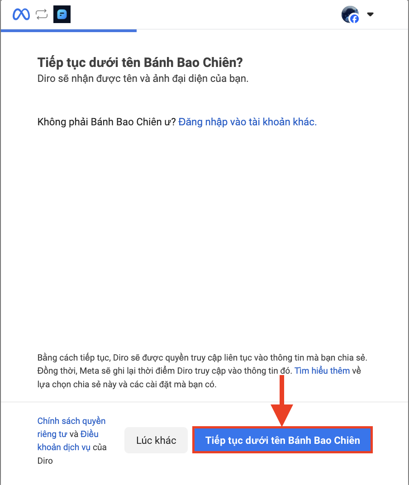
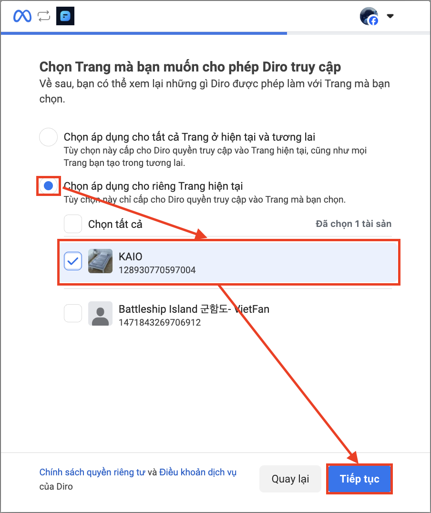
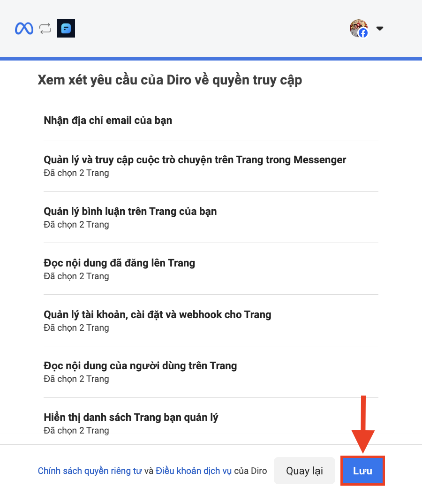

# Hướng dẫn sử dụng Diro
# 🔑 Kích hoạt tài khoản Facebook
Để bắt đầu sử dụng Diro, bạn cần chuẩn bị tài khoản Facebook kết nối với các Fanpage mà mình muốn quản lý. Hãy đảm bảo rằng bạn đang là quản trị viên của các Fanpage đó để việc kết nối diễn ra suôn sẻ.

👉 Các bước thực hiện:

🔹 Bước 1 : Truy cập vào trang web: [https://diro.ai/](https://diro.ai/)

🔹 Bước 2 : Nhấn vào nút **"Đăng nhập"** có logo Facebook

🔹 Bước 3 : Chọn **"Tiếp tục"**

🔹 Bước 4 : Chọn ô **"Chọn áp dụng cho riêng Trang hiện tại"**(*) - Chọn các **Fanpage** bạn muốn sử dụng với Diro và chọn "Tiếp tục"

**Nếu bạn muốn các Trang mới mà bạn quản lý trong tương lai tự động kết nối với Diro, hãy chọn "Chọn áp dụng cho tất cả Trang ở hiện tại và tương lai"*

🔹 Bước 5 : Chọn **"Lưu"** và **"Đã hiểu"**

Như vậy, Bạn đã hoàn thành kết nối tài khoản Facebook với Diro
