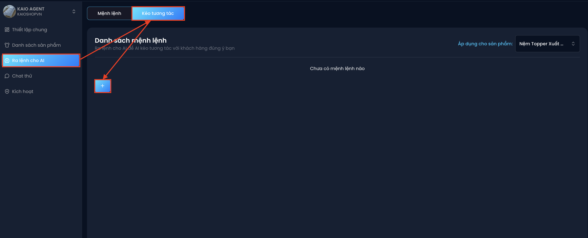
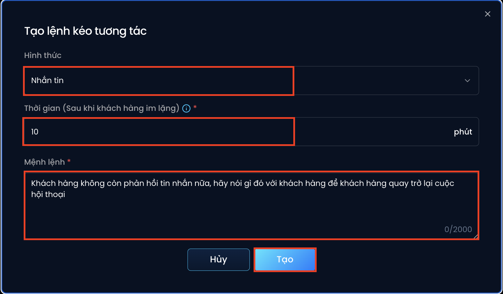
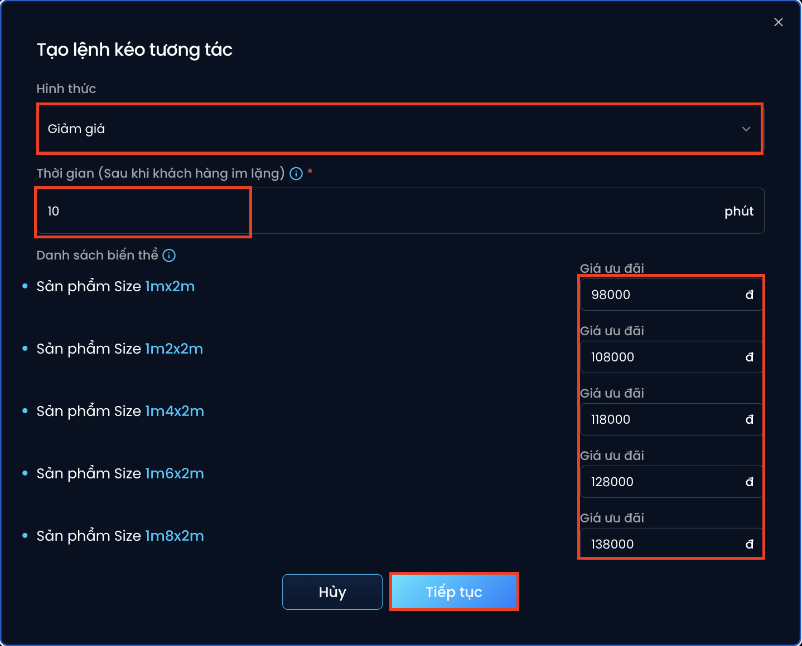
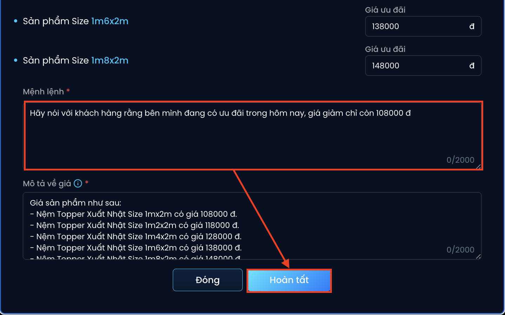
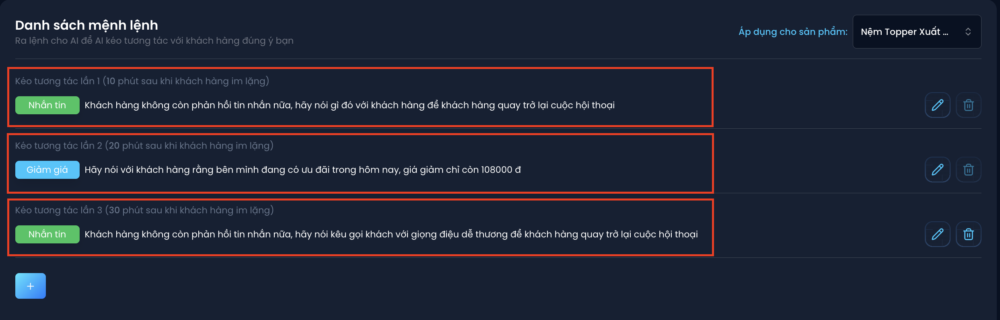

# Cài đặt lệnh kéo tương tác khi khách hàng không phản hồi
AI có thể tự động gửi lại tin nhắn hoặc gửi giảm giá để kích thích khách hàng phản hồi nếu họ không phản hồi quá lâu:

### 1. Hình thức gửi tin nhắn:
🔹 Bước 1: Chọn “ra lệnh cho AI” -> Chọn “Kéo tương tác” -> Nhấn chọn biểu tượng “+”

🔹 Bước 2 : Nhập lệnh phản hồi
  - Chọn hình thức "Nhắn tin"
  - Thời gian sau khi khách hàng im lặng (ví dụ : 10 phút)
  - Nhập mệnh lệnh tin nhắn  
  *Ví dụ : “ Khách hàng không còn phản hồi tin nhắn nữa, hãy nói gì đó với khách hàng để khách hàng quay trở lại cuộc hội thoại”*

🔹 Bước 3 : Nhấn “ Tạo” để hoàn thành

### 2. Hình thức giảm giá:
🔹 Bước 1: Chọn “ra lệnh cho AI” -> Chọn “Kéo tương tác” -> Nhấn chọn biểu tượng “+”

🔹 Bước 2 : Nhập lệnh phản hồi
  - Chọn hình thức “Giảm giá”
  - Thời gian sau khi khách hàng im lặng (ví dụ : 10 phút)
  - Nhập mức giá ưu đãi
  - Nhấn “Tiếp tục”

🔹 Bước 3 : Nhập mệnh lệnh tin nhắn

*Ví dụ : “ Hãy nói với khách hàng rằng mình có thể tặng voucher giảm giá theo sự kiện để có giá tốt nhất”*

### 3. Hình thức kết hợp tin nhắn và giảm giá:
Hãy kết hợp linh hoạt nhiều hình thức tương tác để xây dựng một **kịch bản tương tác khách hàng liên tục.**

Điều này không chỉ giúp **duy trì sự quan tâm của khách hàng**, mà còn **giảm thiểu rủi ro mất khách giữa chừng**, đặc biệt trong quá trình tư vấn – chốt đơn.

*Ví dụ : Sau 10 phút hãy nhắn tin cho khách hàng - Sau 20 phút hãy giảm giá - Sau 30 phút hãy nhắn tin cho khách hàng*

**Lưu ý : Mỗi tương tác cách nhau tối thiểu 10 phút.*