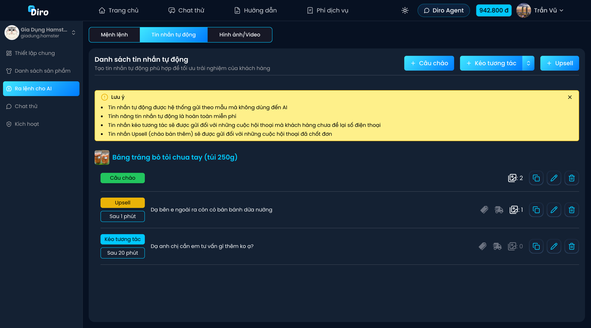
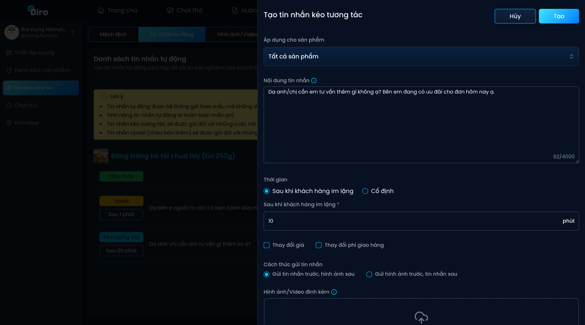

# Tin nhắn tự động – Kéo tương tác khi khách hàng không phản hồi

Khi khách hàng đọc tin rồi im lặng, bạn có thể để hệ thống tự nhắn lại nhằm kéo khách quay lại cuộc hội thoại. Tính năng này nằm trong nhóm **Tin nhắn tự động**.

🔹 Vào **“Ra lệnh cho AI”** → chọn tab **“Tin nhắn tự động”**

Có 3 loại tin nhắn tự động, tạo bằng các nút tương ứng ở góc phải:

| Loại | Gửi cho cuộc hội thoại nào |
| --- | --- |
| **Câu chào** | Khi khách vừa bắt đầu cuộc hội thoại |
| **Kéo tương tác** | Khách **chưa để lại số điện thoại** |
| **Upsell** | Khách **đã chốt đơn** (chào bán thêm) |

:::info Cần nhớ
Tin nhắn tự động được hệ thống gửi **theo đúng mẫu bạn soạn, không đi qua AI**. Vì vậy nội dung bạn nhập ở đây chính là nội dung khách nhận được, chứ không phải mệnh lệnh để AI diễn đạt lại. Tính năng này **hoàn toàn miễn phí**.
:::

## Tạo tin nhắn kéo tương tác

🔹 Bước 1: Nhấn nút **“+ Kéo tương tác”**

🔹 Bước 2: Điền nội dung

- **Áp dụng cho sản phẩm**: chọn một sản phẩm cụ thể, hoặc để **“Tất cả sản phẩm”**
- **Nội dung tin nhắn**: câu chữ khách sẽ nhận được (tối đa 4.000 ký tự)  
  *Ví dụ: “Dạ anh/chị cần em tư vấn thêm gì không ạ? Bên em đang có ưu đãi cho đơn hôm nay ạ.”*
- **Thời gian**: chọn 1 trong 2 cách
  - **Sau khi khách hàng im lặng**: nhập số phút, ví dụ 10 phút kể từ lúc khách ngừng trả lời
  - **Cố định**: gửi theo các khung giờ cố định trong ngày – cần chọn **ít nhất 2 khung giờ**
- **Cách thức gửi tin nhắn**: gửi tin nhắn trước rồi hình ảnh sau, hoặc ngược lại
- **Hình ảnh/Video đính kèm**: tối đa 15 file, ảnh ≤ 8MB, video MP4 ≤ 25MB

🔹 Bước 3: Nhấn **“Tạo”** để hoàn thành

## Kèm ưu đãi để kéo khách quay lại

Trong cùng một tin nhắn kéo tương tác, bạn có thể tick thêm:

- **Thay đổi giá** → mở ô **“Mô tả về giá”**. Nội dung này sẽ **thay thế cho mô tả về giá gốc** đã đặt bên tab *Mệnh lệnh*.
- **Thay đổi phí giao hàng** → mở ô **“Mô tả về phí giao hàng”**, thay thế cho mô tả phí giao hàng gốc.

👉 Đây là cách tung ưu đãi khi khách còn do dự: tin nhắn vừa nhắc khách, vừa áp một mức giá hoặc phí giao hàng tốt hơn bảng giá thường.

## Xây kịch bản nhiều bước

Bạn có thể tạo nhiều tin kéo tương tác với các mốc thời gian khác nhau để duy trì sự quan tâm của khách và giảm rủi ro mất khách giữa chừng.

*Ví dụ: sau 10 phút nhắn nhắc – sau 20 phút nhắn kèm ưu đãi giá – sau 30 phút nhắn kèm miễn phí giao hàng.*
