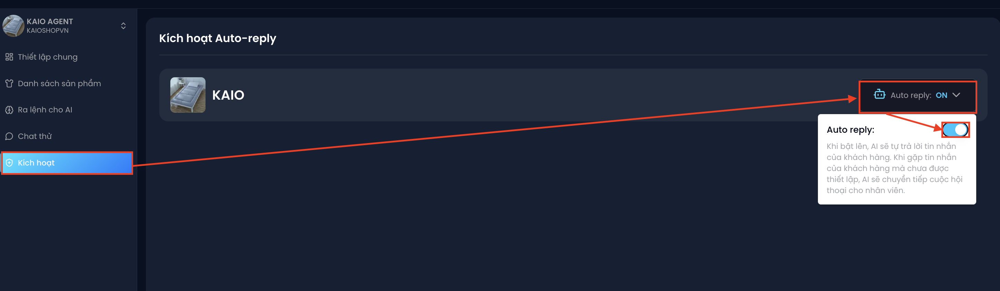

# Kích hoạt AI – Bắt đầu bán hàng tự động
Sau khi bạn đã hoàn tất mọi bước cấu hình cho AI Agent, đây là lúc kích hoạt AI để đưa hệ thống vào vận hành thực tế.

🔹 Bước 1: Trong Chat Agent, chọn mục **“Kích hoạt”** ở menu bên trái

🔹 Bước 2: Bấm vào **“Auto reply”** trên thẻ Fanpage và gạt công tắc sang **ON** để AI bắt đầu tự trả lời khách hàng

:::tip
Khi bật, AI sẽ tự trả lời tin nhắn của khách. Nếu gặp tin nhắn nằm ngoài phần bạn đã thiết lập, AI sẽ chuyển tiếp cuộc hội thoại cho nhân viên.
:::

Trạng thái bật/tắt này cũng hiện ngay trên thẻ Fanpage ở **Bảng điều khiển** (*Chat Agent: ON / OFF*), nên bạn kiểm tra nhanh được mà không cần vào từng Agent.