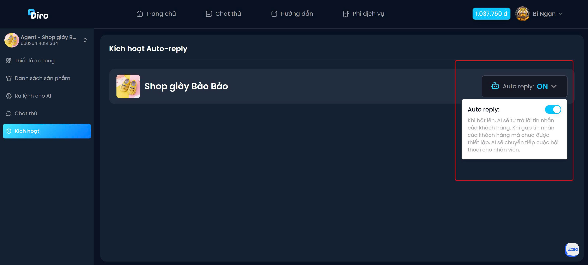

# Kích hoạt AI
Sau khi hoàn tất quá trình cài đặt, bạn chỉ cần nhấn vào mục ‘Kích hoạt AI’ và chọn ‘Turn On’ để bắt đầu cho AI hoạt động. Để đảm bảo hệ thống vận hành trơn tru, hãy kiểm tra lại toàn bộ quy trình với tài khoản thật, nhằm phát hiện và điều chỉnh kịp thời bất kỳ vấn đề phát sinh nào.
