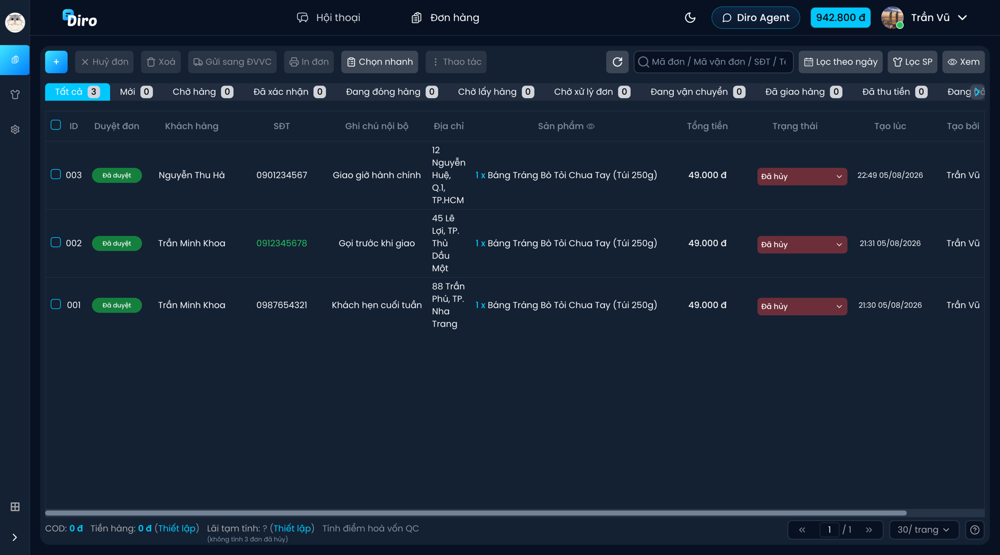

# Quản lý đơn hàng

Toàn bộ đơn do AI chốt hoặc bạn nhập tay đều nằm trong một bảng duy nhất: tên khách, số điện thoại, địa chỉ, sản phẩm, tổng tiền, trạng thái… được cập nhật liên tục.

🔹 Trên thanh menu, chọn **“Đơn hàng”**

*Ảnh minh hoạ dùng dữ liệu mẫu.*

## Lọc và tìm đơn

- **Dải trạng thái** ngay dưới thanh công cụ cho biết số đơn ở từng trạng thái, bấm để lọc: Tất cả, Mới, Chờ hàng, Đã xác nhận, Đang đóng hàng, Chờ lấy hàng, Chờ xử lý đơn, Đang vận chuyển, Đã giao hàng, Đã thu tiền, Đang trả hàng, Đã trả hàng một phần, Đã trả hàng, Đã hủy, Đã xóa.
- **Ô tìm kiếm** tìm theo **Mã đơn / Mã vận đơn / SĐT / Tên khách**.
- **Lọc theo ngày** và **Lọc SP** (lọc theo sản phẩm) để thu hẹp thêm.
- **Xem** cho phép chọn những cột muốn hiển thị.

## Các thao tác trên thanh công cụ

| Nút | Tác dụng |
| --- | --- |
| **+** | Thêm đơn hàng thủ công |
| **Huỷ đơn** | Huỷ các đơn đang chọn |
| **Xoá** | Xoá các đơn đang chọn |
| **Gửi sang ĐVVC** | Đẩy đơn sang đơn vị vận chuyển để lấy mã vận đơn |
| **In đơn** | In phiếu giao hàng cho các đơn đang chọn |
| **Chọn nhanh** | Chọn nhanh nhiều đơn theo điều kiện |
| **Thao tác** | Các thao tác hàng loạt khác cho những đơn đang chọn |

:::caution Lưu ý
**Gửi sang ĐVVC** sẽ tạo vận đơn thật bên đơn vị vận chuyển. Hãy kiểm tra kỹ địa chỉ và số tiền thu hộ trước khi bấm.
:::

## Cột dữ liệu

Bảng hiển thị: **ID**, **Duyệt đơn**, **Khách hàng**, **SĐT**, **Ghi chú nội bộ**, **Địa chỉ**, **Sản phẩm**, **Tổng tiền**, **Trạng thái**, **Tạo lúc**, **Tạo bởi**.

- Cột **Trạng thái** là danh sách thả xuống, đổi trạng thái ngay trên dòng mà không cần mở đơn.
- Cột **Ghi chú nội bộ** sửa trực tiếp bằng biểu tượng bút chì. Ghi chú này chỉ bạn thấy, khách không thấy.
- Bấm vào một dòng để mở **chi tiết đơn**: sửa thông tin khách, sản phẩm, số tiền rồi nhấn **“Lưu”**.

## Thanh tổng kết cuối bảng

Cuối bảng hiển thị nhanh **COD**, **Tiền hàng**, **Lãi tạm tính** và **điểm hoà vốn quảng cáo** cho tập đơn đang lọc — tiện để soát doanh thu theo ngày mà không cần xuất báo cáo.
