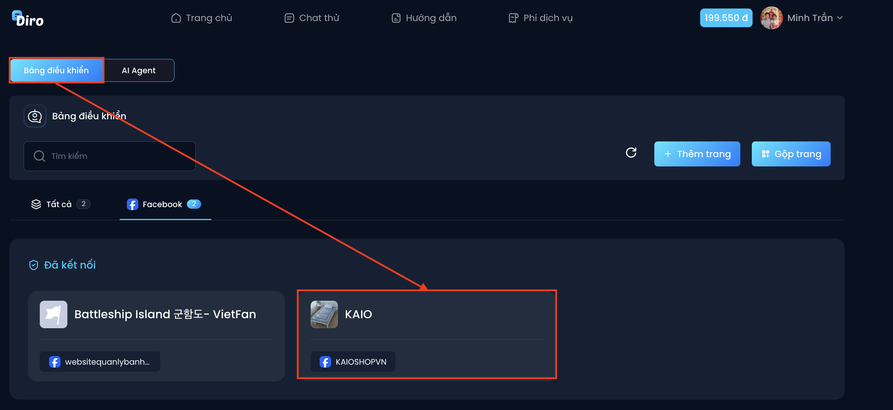
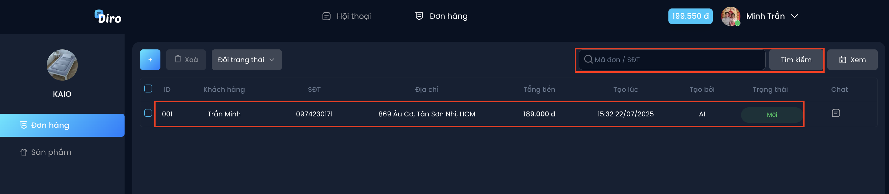
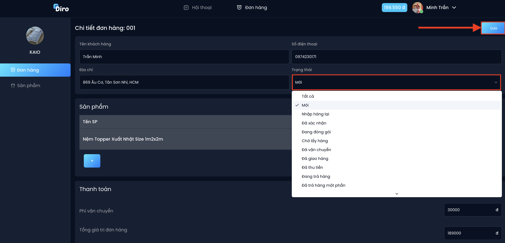
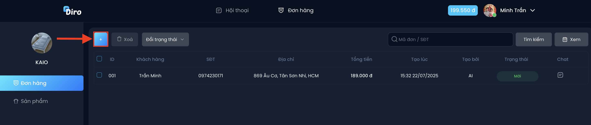

# Quản lý tin nhắn
Diro quản lý toàn bộ tin nhắn từ Fanpage Facebook, quảng cáo **trên một giao diện duy nhất.**

🔹 Bước 1: Chọn **“Bảng điều khiển”** -> Chọn **Fanpage** muốn xem tin nhắn

🔹 Bước 2: Xem nội dung tin nhắn hoặc nhắn tin trực tiếp với khách hàng

**Diro tự động lọc thông tin số điện thoại khách hàng để bạn tìm kiếm nhanh chóng tại “📱”*

🔹 Bước 3: Xem thông tin liên quan như **Người xử lý** ( AI hoặc nhân viên ), **Trạng thái**, Thêm **ghi chú**. Nếu có sự thay đổi, hãy nhấn **Lưu** để hoàn thành

🔹 Bước 4: Bạn có thể tim kiếm tin nhắn bằng thông tin **Người xử lý** ( AI hoặc nhân viên ), **Trạng thái**. Chọn **“Áp dụng”** để bắt đầu tìm kiếm

