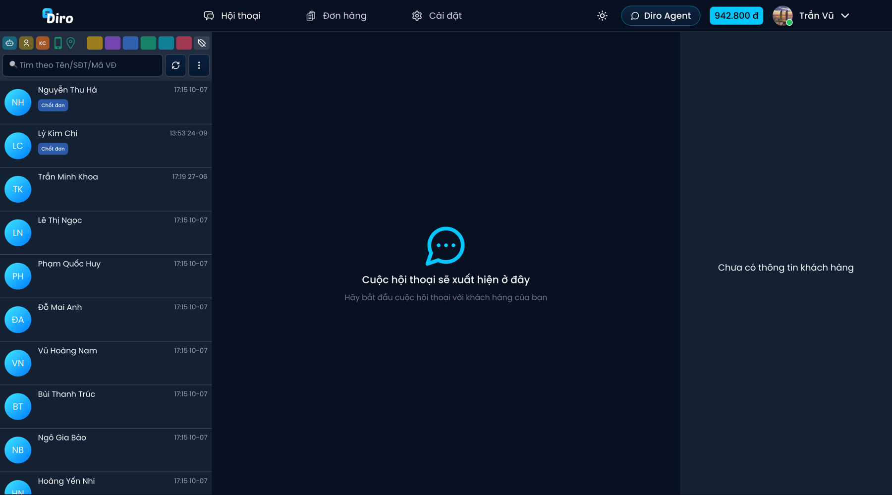

# Quản lý tin nhắn

Diro gom tin nhắn từ Fanpage và từ quảng cáo về **một giao diện duy nhất**, để bạn không phải mở từng trang.

🔹 Trên thanh menu, chọn **“Hội thoại”**

*Ảnh minh hoạ dùng tên khách hàng mẫu.*

## Bố cục màn hình

Màn hình chia làm 3 phần:

- **Bên trái** – danh sách cuộc hội thoại, kèm thẻ trạng thái (ví dụ *Chốt đơn*) và thời điểm tin nhắn gần nhất.
- **Ở giữa** – nội dung hội thoại. Bạn có thể nhắn trực tiếp cho khách từ đây.
- **Bên phải** – thông tin khách hàng của cuộc hội thoại đang mở.

## Tìm và lọc hội thoại

- **Ô tìm kiếm** tìm theo **Tên / SĐT / Mã vận đơn**.
- **Hàng biểu tượng** phía trên ô tìm kiếm là 5 bộ lọc nhanh, theo thứ tự từ trái sang:

  | Biểu tượng | Lọc ra |
  | --- | --- |
  | 🤖 | Hội thoại đang do **AI** xử lý |
  | 👤 | Hội thoại đang do **nhân viên** xử lý |
  | **KC** | **Khách cũ** – khách đã từng mua trước đó |
  | 📱 | Hội thoại **đã có số điện thoại** |
  | 📍 | Hội thoại **đã có địa chỉ** |

- **Dải màu** bên phải các biểu tượng là bộ lọc theo **nhãn màu** bạn gắn cho hội thoại.

## Trạng thái và thẻ

Mỗi cuộc hội thoại có **trạng thái** để bạn ưu tiên xử lý, tránh bỏ sót khách:

| Trạng thái | Ý nghĩa |
| --- | --- |
| Tư vấn | Đang trao đổi với khách |
| Tiềm năng | Khách có khả năng mua |
| Chốt đơn | Khách đã đồng ý mua |
| Đã gửi | Hàng đã gửi đi |
| Hết hàng | Sản phẩm khách hỏi đã hết |
| Trả hàng | Khách trả lại hàng |

Ngoài trạng thái, hội thoại còn có **thẻ**: *Chờ xử lý đơn*, *Câu hỏi*, *Chốt đơn*, *Đã gửi*, *Hết hàng*, *Trả hàng*.

:::note
Thẻ **“Chờ xử lý đơn”** do hệ thống tự gắn và tự gỡ theo trạng thái đơn bên đơn vị vận chuyển – bạn không bật/tắt thủ công được.
:::
