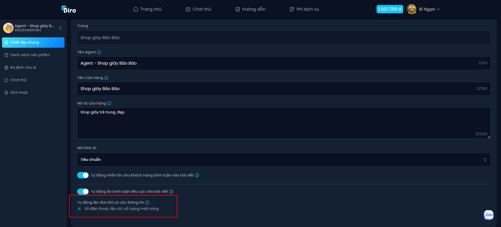
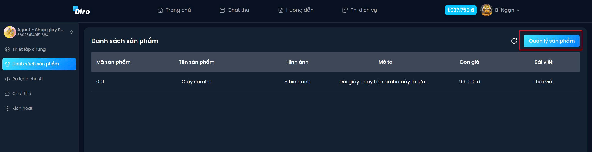
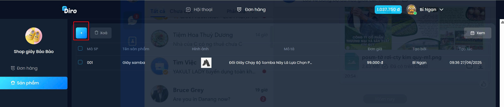
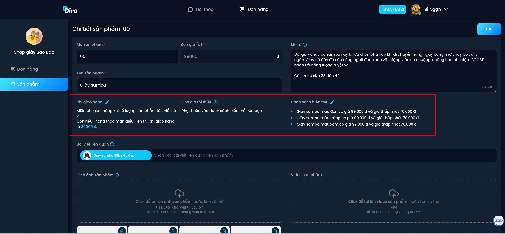
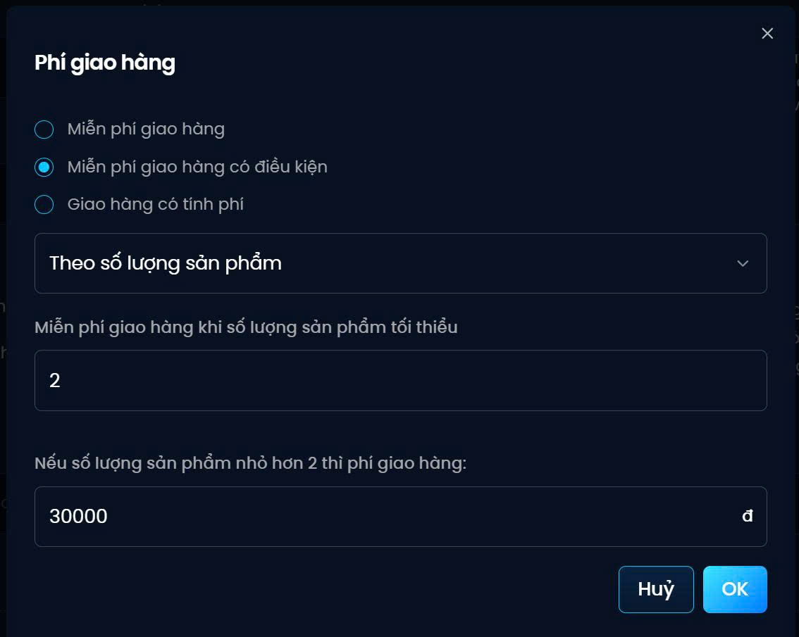
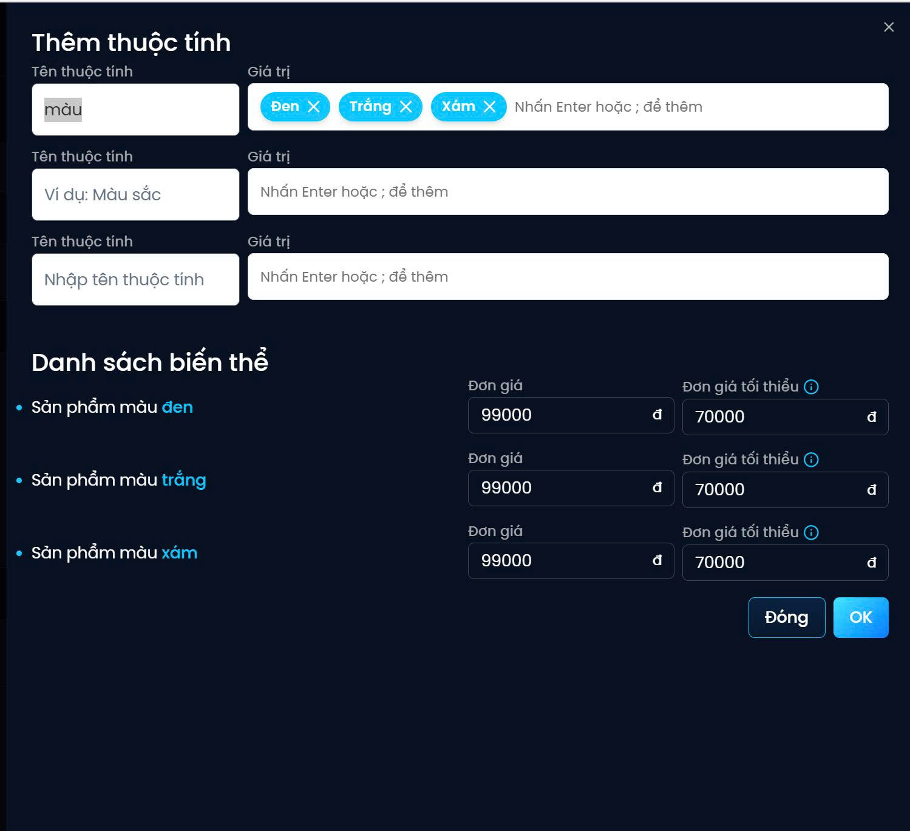
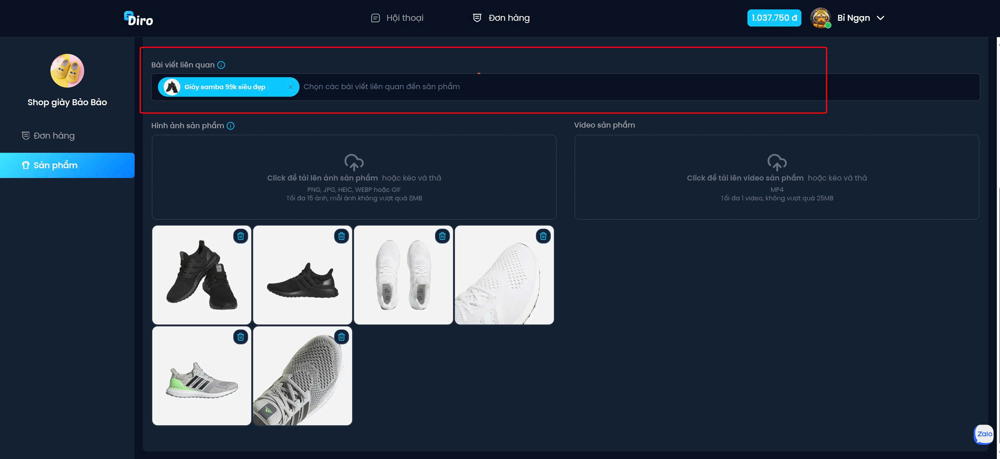

# Hướng dẫn tạo sản phẩm
- Trong mục tiêu của Ai chọn **Tự động lên đơn khi có cac thông tin sau: Số điện thoại, địa chỉ, số lượng đơn hàng"** công cụ thêm sản phẩm sẽ hoạt động ở danh mục **Danh sách sản phẩm**

## Bước 1: Chọn vào **Danh sách sản phẩm** chọn tiếp **Quản lý sản phẩm** nhấn vào biểu tượng **+** 

## Bước 2: Điều những thông tin về sản phẩm, 

### Có 3 đặc tính thông minh để chủ shop thiết lập như:
- Phí giao hàng: để phù hợp với chương trình của cửa hàng:

- Danh sách biến thể & Đơn giá tối thiểu:
 
Giúp cho khách hàng và người tiêu dùng dễ phân loại sản phẩm khi mua sắm online.
- Chọn bài viết liên quan: chọn bài viết quảng cáo trên fanpage có liên quan đến sản phẩm nhằm giúp Ai tự động tư vấn  những bình luận của khách hàng về sản phẩm.

Cuối cùng chọn hình ảnh, video liên quan đến sản phẩm, Ai sẽ dùng những hình ảnh này để gửi cho khách hàng khi tư vấn ạ.
## Bước 3: Đừng quên nhấn vào **Lưu** để hoàn tất quá trình tạo sản phẩm nha.

