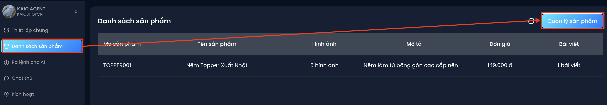
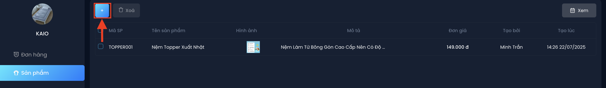
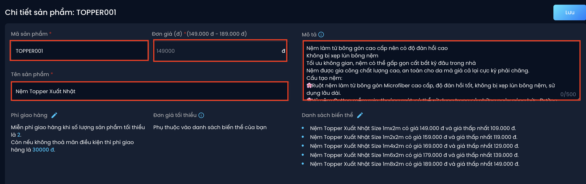
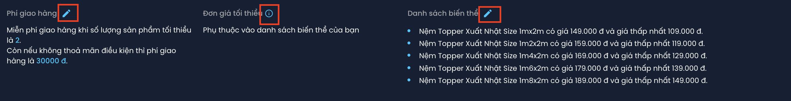
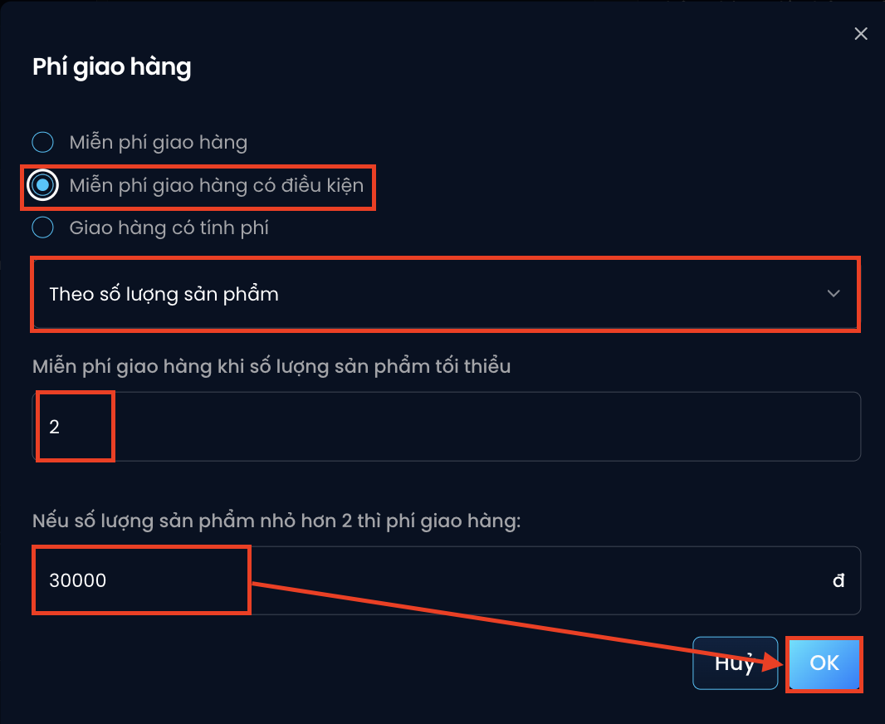
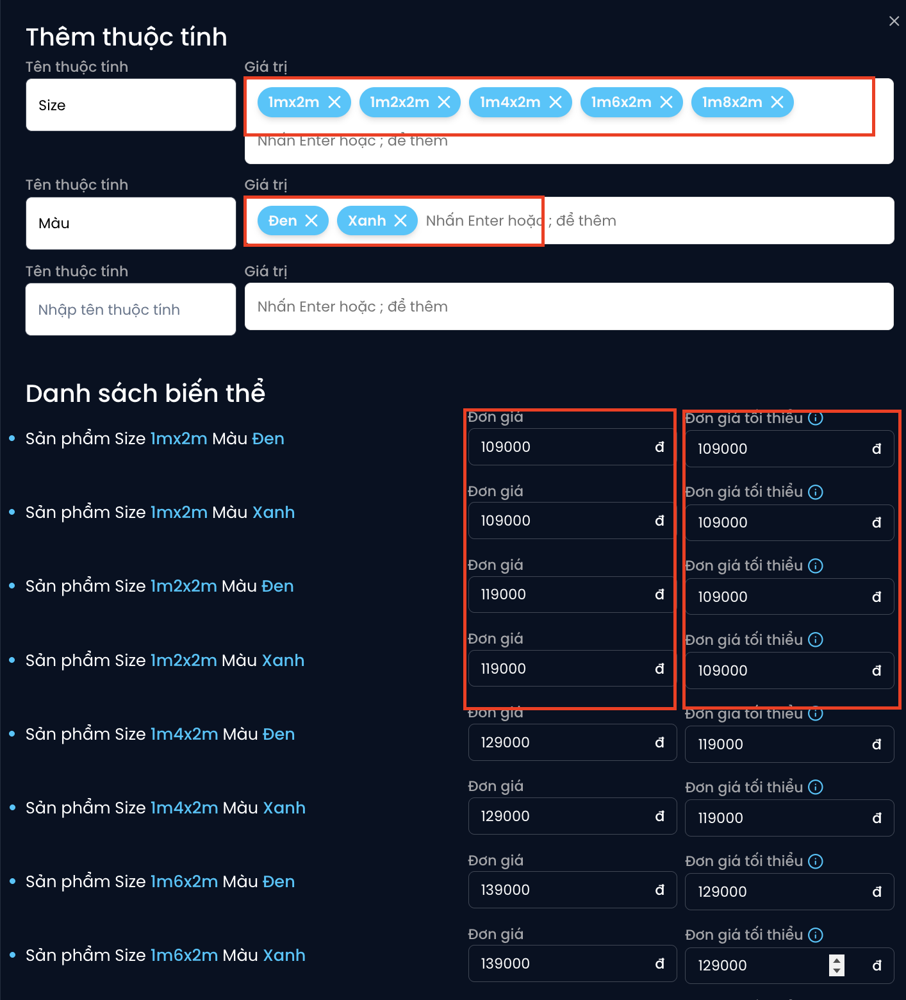
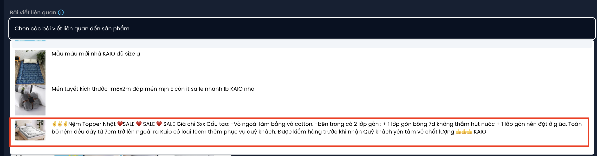
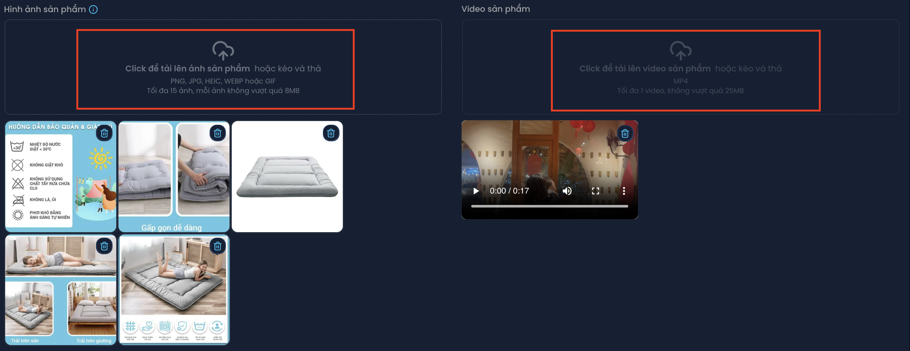
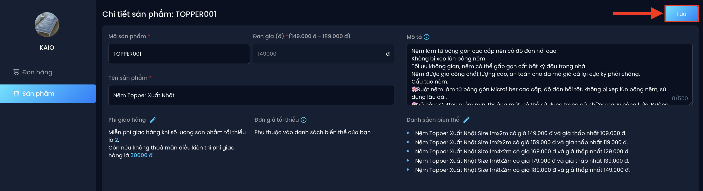

# Hướng dẫn tạo sản phẩm
- Trong mục tiêu của AI chọn **Tự động lên đơn khi có cac thông tin sau: Số điện thoại, địa chỉ, số lượng đơn hàng"** công cụ thêm sản phẩm sẽ hoạt động ở danh mục **Danh sách sản phẩm**

### 🔹 Bước 1: Truy cập mục Danh sách sản phẩm
- Vào **“Danh sách sản phẩm”** trên thanh menu

- Nhấn **“Quản lý sản phẩm”**, sau đó bấm vào biểu tượng **"+"** để thêm sản phẩm mới

### 🔹 Bước 2: Nhập thông tin sản phẩm
Điền đầy đủ thông tin cơ bản: Mã sản phẩm, Tên sản phẩm, mô tả, giá bán

Bổ sung 3 thông tin sau giúp AI tư vấn và chốt đơn hiệu quả hơn:

1. **Phí giao hàng**

👉 Thiết lập mức phí linh hoạt với chính sách cửa hàng (miễn phí, có phí hoặc miễn phí có điều kiện). Sau đó **chọn “OK”** để lưu lại.

Ví dụ : *thiết lập “Nếu mua từ **2 sản phẩm** sẽ **miễn phí giao hàng**, nếu mua **dưới 2 sản phẩm**, phí giao hàng là **30.000**”*

2. **Danh sách biến thể & đơn giá tối thiểu**

👉 Thiết lập các biến thể như màu sắc, size, … đồng thời thiết lập được đơn giá và đơn giá tối thiểu theo từng biến thể. Sau đó chọn **“OK”** để lưu lại

Ví dụ : *Thiết lập sản phẩm với **5 size** và **2 màu** khác nhau. Điền đơn giá theo từng biến thể từ **109.000 đến 149.000** và điền đơn giá tối thiểu từ **109.000 đến 139.000***

3. **Chọn bài viết liên quan**

👉 Chọn một hoặc nhiều **bài quảng cáo trên Fanpage** có liên quan đến sản phẩm. AI sẽ dùng bài viết này để **nhận diện bình luận về sản phẩm** và tự động nhắn tin tư vấn phù hợp.

4. **Thêm hình ảnh & video sản phẩm**

👉 Chọn những hình ảnh/video minh họa. AI sẽ **gửi tự động cho khách hàng** trong quá trình tư vấn, giúp tăng tính thuyết phục và trải nghiệm mua sắm.

*Lưu ý:  
-*Tối đa 15 hình ảnh, mỗi hình ảnh dung lượng tối đa 8MB*  
-*Tối đa 1 video, dung lượng tối đa 25MB*

### 🔹 Bước 3: Lưu sản phẩm
Sau khi hoàn tất thông tin, đừng quên nhấn **"Lưu"** để lưu sản phẩm vào hệ thống.

✅ Khi thiết lập đầy đủ, AI có thể tự nhận diện khách đang quan tâm sản phẩm nào, tư vấn theo đúng bài viết và tạo đơn hàng chỉ sau vài tin nhắn. Rất phù hợp với bán hàng tự động trên Facebook!
