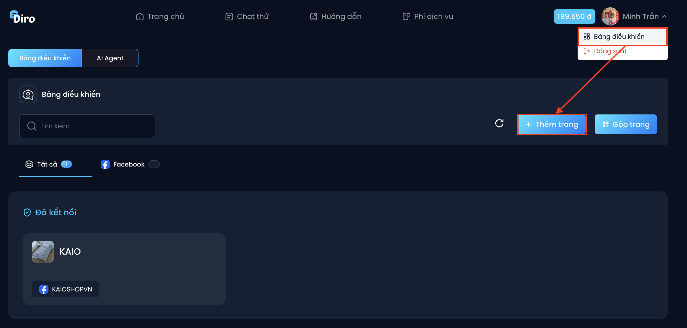
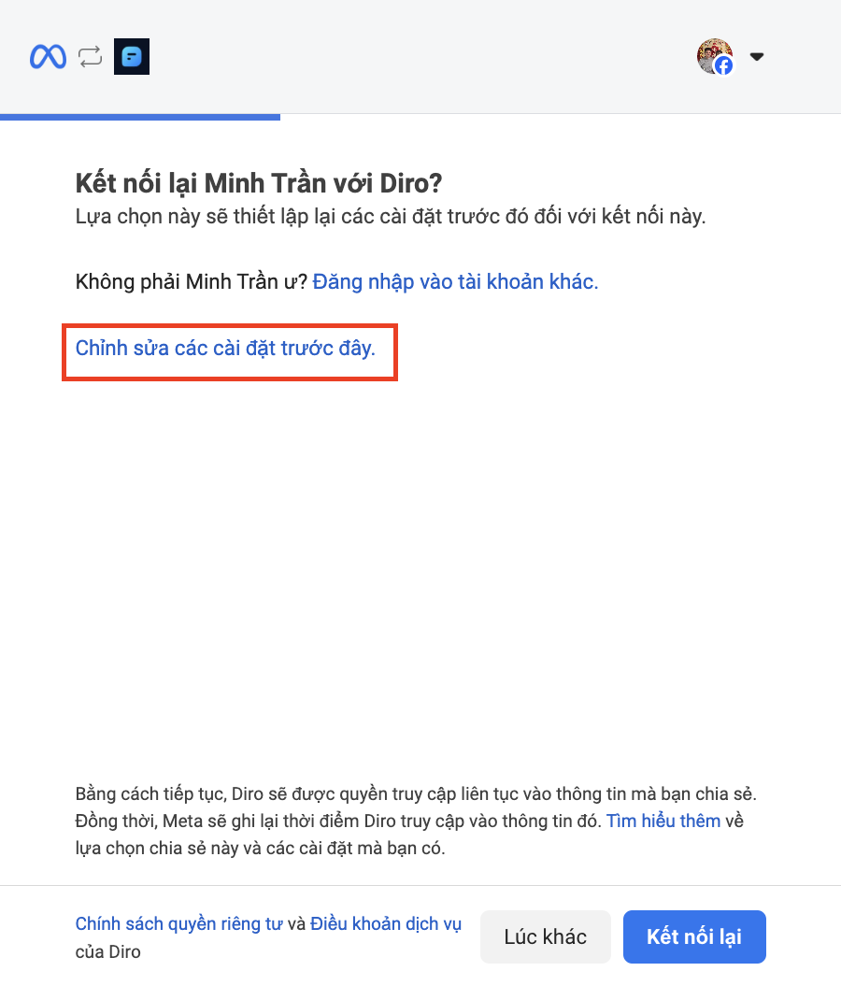
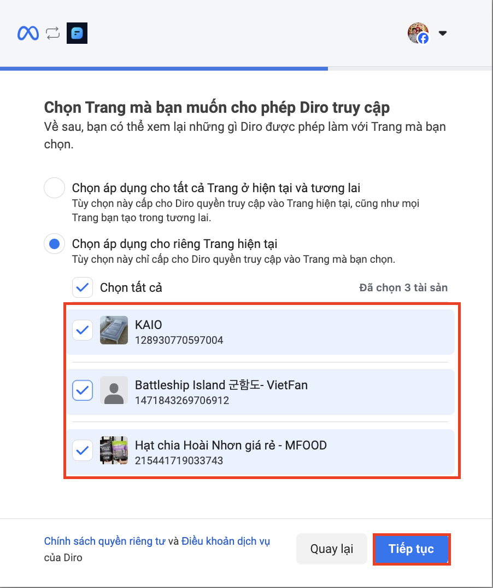
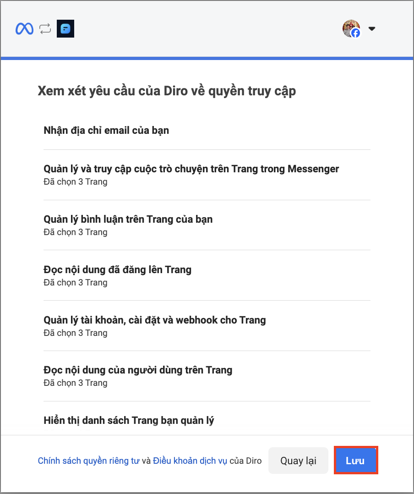
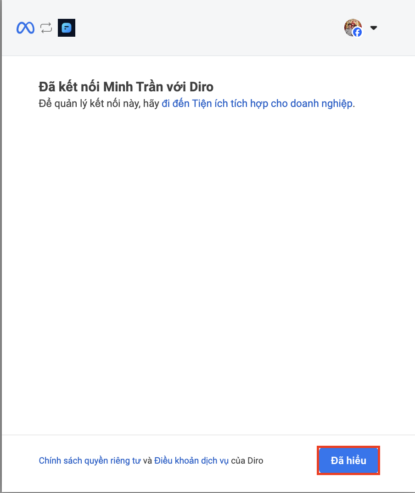

# Kết nối thêm Fanpage vào Diro
Để thêm Fanpage vào Diro, hãy đảm bảo rằng bạn đang là quản trị viên của các Fanpage đó để việc kết nối diễn ra suôn sẻ.

🔹 Bước 1: Chọn vào biểu tượng tài khoản - Chọn **“Bảng điều khiển”** - Chọn **“+ Thêm trang” **

🔹 Bước 2: Chọn vào **“Chỉnh sửa các cài đặt trước đây”**

🔹 Bước 3: Chọn ô **“Chọn áp dụng cho riêng Trang hiện tại”**(*) - Chọn các **Fanpage** bạn muốn thêm vào sử dụng với Diro và chọn **“Tiếp tục”**

**Nếu bạn muốn các Trang mới mà bạn quản lý trong tương lai tự động kết nối với Diro, hãy chọn “Chọn áp dụng cho tất cả Trang ở hiện tại và tương lai”*

🔹 Bước 4: Chọn **“Lưu”** và **“Đã hiểu”**

 

Như vậy, Bạn đã hoàn thành kết nối thêm Fanpage với Diro
