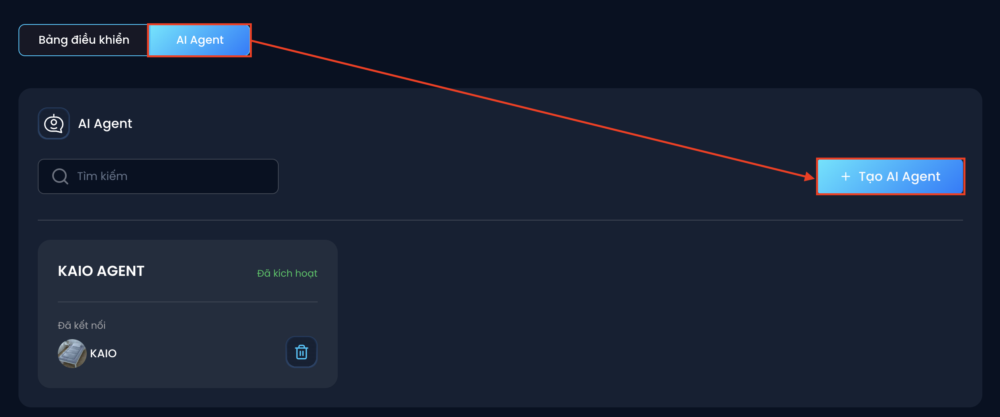
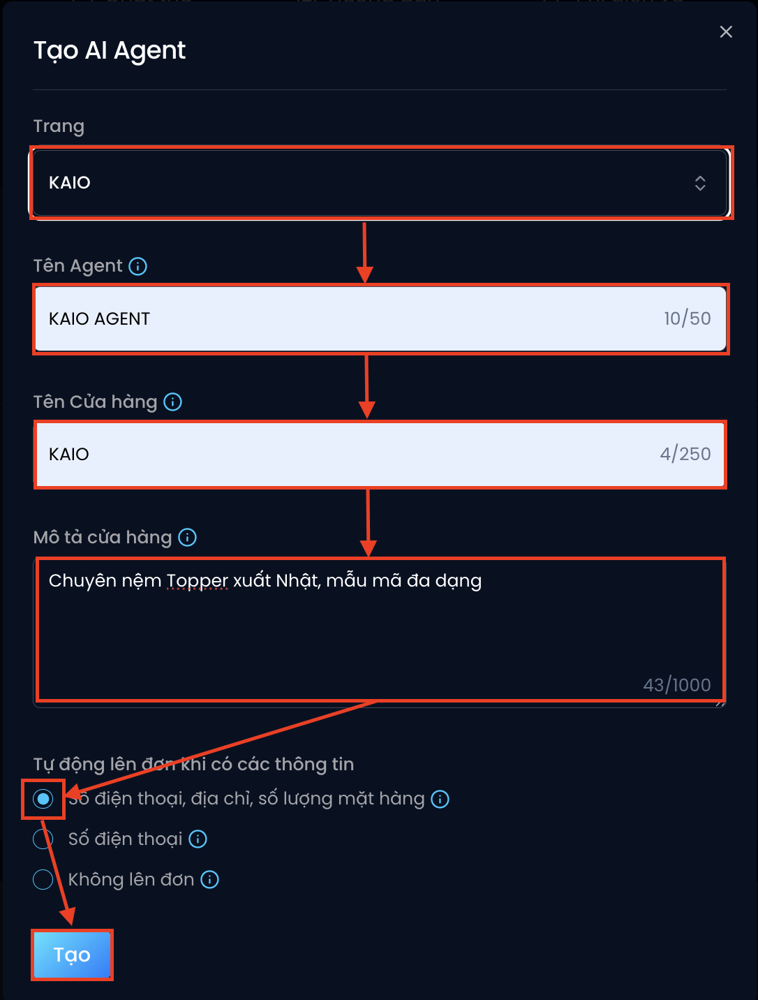

# Tạo AI Agent cho Fanpage
👉 Sau khi đã đăng nhập, bạn có thể bắt đầu tạo AI Agent cho Fanpage của mình theo các bước sau:

🔹 Bước 1: Chọn mục "AI Agent" trong giao diện chính và chọn "Tạo AI Agent"

🔹 Bước 2: Điền thông tin cấu hình cho AI Agent

1. Trang: Chọn Fanpage mà bạn muốn kết nối

2. Tên Agent: Đặt tên dễ nhớ để bạn dễ quản lý (ví dụ: *KAIO - Nệm, Shop nệm...*)

3. Tên cửa hàng: AI sẽ dùng tên này khi trò chuyện với khách (ví dụ: Chào chị, em đến từ **KAIO shop** ạ!)

4. Mô tả cửa hàng: Dùng để AI giới thiệu về cửa hàng/sản phẩm khi cần (ví dụ: *Bên em **chuyên nệm Topper xuất Nhật, mẫu mã đang dạng ạ***)

5. Bạn hãy chọn 1 trong 3 tiêu chí sau để Diro tối ưu kịch bản AI theo mục đích:
* Bán sản phẩm:  
👉 Lấy **số điện thoại, địa chỉ, số lượng mặt hàng** để lên đơn
* Lấy thông tin từ khách hàng để tư vấn (BĐS, khóa học, du lịch...)  
👉 Chỉ lấy **số điện thoại**, không cần lên đơn
* Chăm sóc khách hàng  
👉 Không lấy thông tin - chỉ dùng để hỗ trợ, trả lời, giữ kết nối khách hàng

6. Bấm **"Tạo"** để hoàn tất

