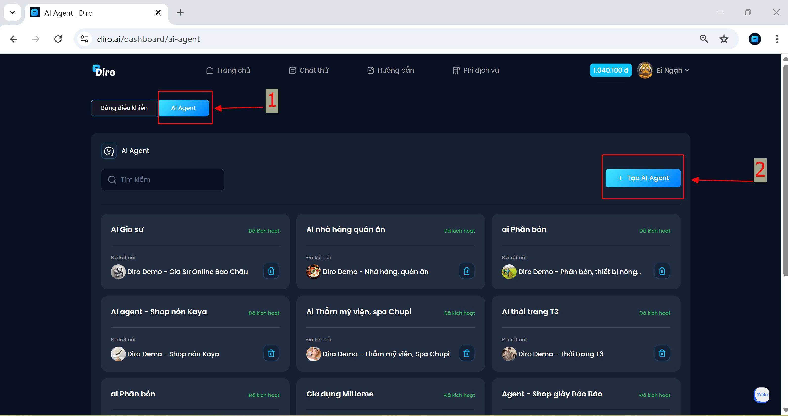
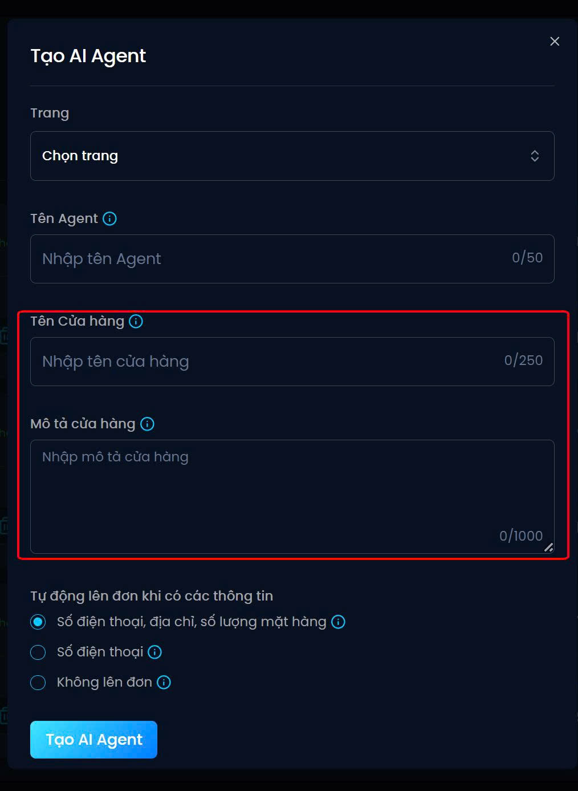

# Tạo AI agent cho tài khoản fanpage
- Đầu tiên chọn  **AI Agent** tiếp tục chọn  **Tạo AI Agent**

Tiếp theo hãy điền thông sau:

- Trang: Chọn Fanpage cần liên kết
- Tên Agent: Hãy đặt tên gợi nhớ

## Thông tin quan trọng:
- **Tên cửa hàng:** AI sẽ sử dụng tên cửa hàng để trò chuyện với khách hàng 
- **Mô tả cửa hàng:** AI sẽ sử dụng phần mô tả để giới thiệu khi trò chuyện với khách hàng
## Hãy chọn 1 trong tiêu chí 3 của AI phù hợp mới mục đích của bạn:
1. Số điện thoại, địa chỉ, số lượng mặt hàng: bán sản phẩm
2. Số điện thoại: bán bất động sản, khóa học, du lịch,.. lấy sđt để tư vấn 
3. Không lên đơn: dùng để chăm sóc khách hàng.

Sau khi hoàn tất thông tin nhấn vào **Tạo AI Agent**