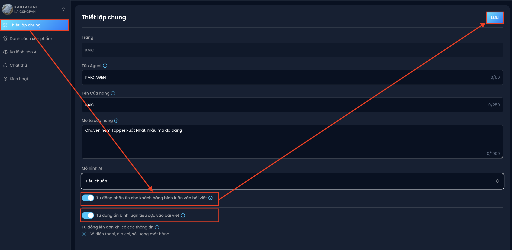

# Thiết lập tính năng tuỳ chỉnh giúp AI quản lý Fanpage hiệu quả hơn
Trong phần **Thiết lập chung**, bạn có thể cập nhật thông tin AI Agent và **bật các tính năng thông minh** để tối ưu hiệu suất chăm sóc khách hàng. Đặc biệt, đừng bỏ qua hai tính năng sau:

### 1. Tự động ẩn bình luận tiêu cực
Hệ thống sẽ tự động quét và ẩn các bình luận có chứa:
- Từ ngữ tiêu cực, chê bai sản phẩm
- Bình luận có tính công kích, phá hoại
- Cạnh tranh không lành mạnh từ đối thủ (ví dụ: để lại số điện thoại, gợi ý inbox chéo)

👉 Nhờ đó, Fanpage của bạn luôn giữ được hình ảnh chuyên nghiệp – tích cực.
### 2. Tự động nhắn tin khi khách hàng bình luận
Khi khách hàng bình luận vào bài viết hoặc quảng cáo với nội dung như:
- Hỏi giá
- Quan tâm sản phẩm
- Để lại số điện thoại

👉 Hệ thống sẽ ngay lập tức gửi tin nhắn tự động đến inbox của khách, có thể là Bảng giá, Thông tin sản phẩm, Link mua hàng, Lời mời inbox để tư vấn kỹ hơn

**Hiệu quả mang lại:**  
👉 Không bỏ sót bất kỳ khách tiềm năng nào,tăng mạnh khả năng tư **vấn – chốt đơn – chăm sóc** khách kịp thời, đặc biệt với các bài quảng cáo có nhiều tương tác.
