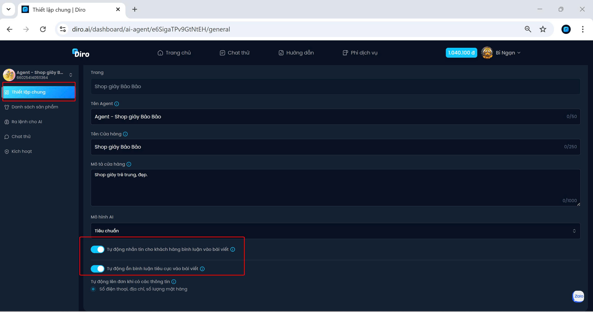
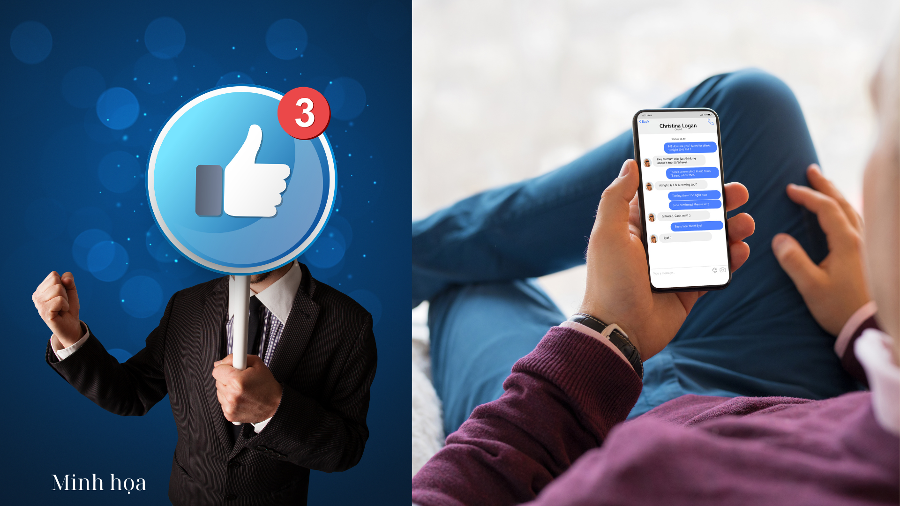

# Hai tính năng thông minh của AI khi quản lý Fanpage
Trong phần **Thiết lập chung**, bạn có thế xem và chỉnh sửa thông tin cho phù hợp.

 Quan trọng là hãy mở hai tính năng:
 - Tự động ẩn bình luận tiêu cực:

Hệ thống sẽ tự động quét các bình luận chứa từ khóa xấu, chê bai, đối thủ dìm hàng hoặc thông tin xấu về shop.
Những bình luận này sẽ bị ẩn đi, khách hàng khác không nhìn thấy, giúp Fanpage giữ hình ảnh chuyên nghiệp, tích cực, tránh bị đối thủ cướp khách.

 - Tự động nhắn tin khi khách hàng bình luận vào bài quảng cáo

Khi khách hàng bình luận hỏi giá, để lại số điện thoại hay quan tâm sản phẩm trên bài quảng cáo, hệ thống sẽ ngay lập tức gửi tin nhắn tự động cho khách.
Nội dung tin nhắn có thể là bảng giá, thông tin sản phẩm, link mua hàng, hoặc lời mời chốt đơn.

**Giúp shop không bỏ sót khách hàng, tăng cơ hội tư vấn – chốt đơn – chăm sóc khách nhanh hơn.**
