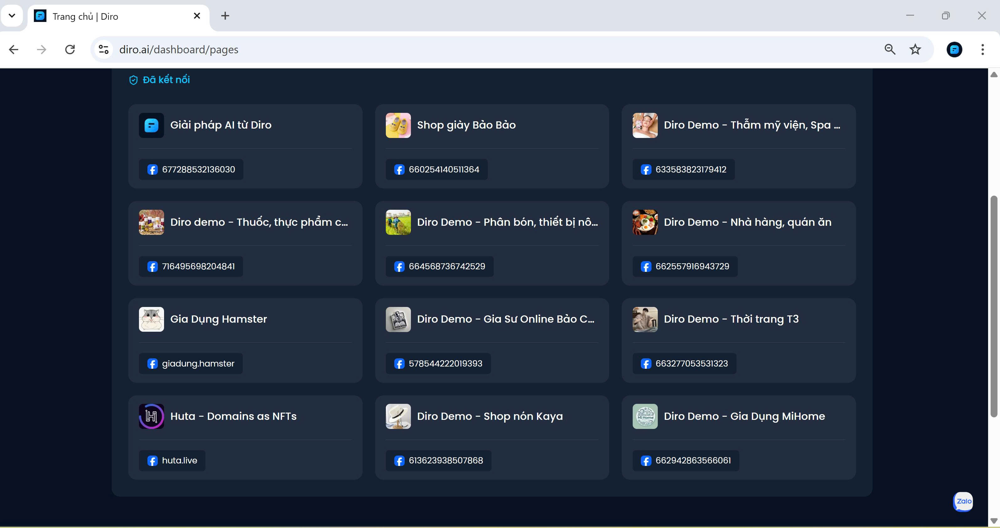

# GIỚI THIỆU VỀ DIRO 
## Diro.ai là gì?
Trang web ứng dụng khoa học hiện đại,  thông minh sáng tạo cộng thêm tính tự động làm việc liên tục 24/7 chỉ cần ra mệnh lệnh Ai sẽ đóng vai trò là một nhân viên tư vấn, chăm sóc khách hàng trên nền tảng như Facebook đem đến thành công vượt trội trong kinh doanh online, tỉ lệ chốt đơn tăng, quản lý fanpage chuyên nghiệp tiết kiệm thời gian và chi phí,... Đây là một tinh hoa của công nghệ nên được ứng dụng vào kinh doanh online, một lựa chọn hoàn hảo của doanh nghiệp.
Các tính năng của Diro.ai

### 1.Dễ dàng quản lý mọi Fanpage trên cùng một nền tảng
**Bạn kinh doanh trên Facebook: bạn sử dụng nhiều Fanpage với nhiều mục đích khác nhau:**
- Fanpage sản phẩm/dịch vụ chính, 
- Fanpage theo nhóm khách hàng mục tiêu, 
- Fanpage cho từng dòng sản phẩm, 
- Fanpage theo khu vực địa lý 
- Fanpage mini chạy chiến dịch ngắn hạn

### 2.  Tự động ẩn bình luận tiêu cực, tự động nhắn tin khi khách hàng bình luận vào bài quảng cáo
**Tự động ẩn bình luận tiêu cực**
- Hệ thống sẽ tự động quét các bình luận chứa từ khóa xấu, chê bai, đối thủ dìm hàng hoặc thông tin xấu về shop.
- Những bình luận này sẽ bị ẩn đi, khách hàng khác không nhìn thấy, giúp Fanpage giữ hình ảnh chuyên nghiệp, tích cực, tránh bị đối thủ cướp khách.

**Tự động nhắn tin khi khách hàng bình luận vào bài quảng cáo**
- Khi khách hàng bình luận hỏi giá, để lại số điện thoại hay quan tâm sản phẩm trên bài quảng cáo, hệ thống sẽ ngay lập tức gửi tin nhắn tự động cho khách.
- Nội dung tin nhắn có thể là bảng giá, thông tin sản phẩm, link mua hàng, hoặc lời mời chốt đơn.
- Giúp shop không bỏ sót khách hàng, tăng cơ hội tư vấn – chốt đơn – chăm sóc khách nhanh hơn.
### 3. Phản hồi tin nhắn có tư duy, linh hoạt như chuyên gia chăm sóc khách hàng – làm việc 24/7
- Hệ thống chatbot tự động trả lời tin nhắn của khách hàng mọi lúc, mọi nơi, kể cả nửa đêm hay ngày lễ.
- Bot không chỉ trả lời cứng nhắc, mà còn phân loại câu hỏi (giá, thông tin sản phẩm, đổi trả, giao hàng…) rồi phản hồi đúng nội dung khách cần, giống như một chuyên gia CSKH chuyên nghiệp.
- Nếu câu hỏi phức tạp, bot sẽ chuyển cho nhân viên thật xử lý, đảm bảo khách luôn được hỗ trợ nhanh chóng.
### 4. Ai cũng dễ dàng sử dụng!
- Dù bạn là chủ shop nhỏ hay doanh nghiệp lớn, chỉ cần vài phút kết nối Fanpage là đã quản lý được hết bình luận, tin nhắn, đơn hàng trên một giao diện duy nhất.
- Không cần biết kỹ thuật, Diro.ai tự động làm mọi thứ cho bạn: ẩn bình luận tiêu cực, trả lời khách hàng 24/7, chốt đơn nhanh hơn.

💥 Đặc biệt, trong thời gian ưu đãi, bạn sẽ được tặng ngay 200K trong tài khoản khi đăng nhập lần đầu để trải nghiệm miễn phí!

**👉 Hãy thử ngay để bán hàng dễ hơn gấp nhiều lần!**