# Các chức năng chính của Diro
**Diro AI là trợ lý bán hàng tự động ứng dụng công nghệ AI ngôn ngữ, giúp doanh nghiệp tư vấn, thuyết phục và chăm sóc khách hàng 24/7.**

Tăng tỷ lệ chốt đơn, giảm chi phí vận hành, nâng trải nghiệm khách hàng – tất cả trong một nền tảng thông minh.

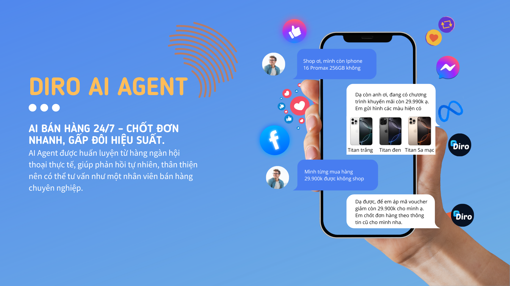
## 1. AI Agent chuyên nghiệp như người thật
Diro AI là một AI agent có khả năng tư vấn cho khách hàng, thuyết phục khách hàng mua hàng và chăm sóc khách hàng rất hiệu quả, tăng khả năng chốt đơn thành công và tăng mức độ hài lòng của khách hàng với sản phẩm và dịch vụ của công ty bạn.
### 1.1 Trả lời tin nhắn như người thật
AI Agent được huấn luyện dựa trên hàng ngàn mẫu hội thoại thực tế trong nhiều ngành khác nhau, giúp nó trả lời tin nhắn với ngôn ngữ tự nhiên, thân thiện, có cảm xúc – như một nhân viên bán hàng chuyên nghiệp. Khách hàng không còn cảm giác đang nói chuyện với "robot", mà giống như đang trò chuyện với một người hiểu rõ sản phẩm và tư vấn chuyên nghiệp.

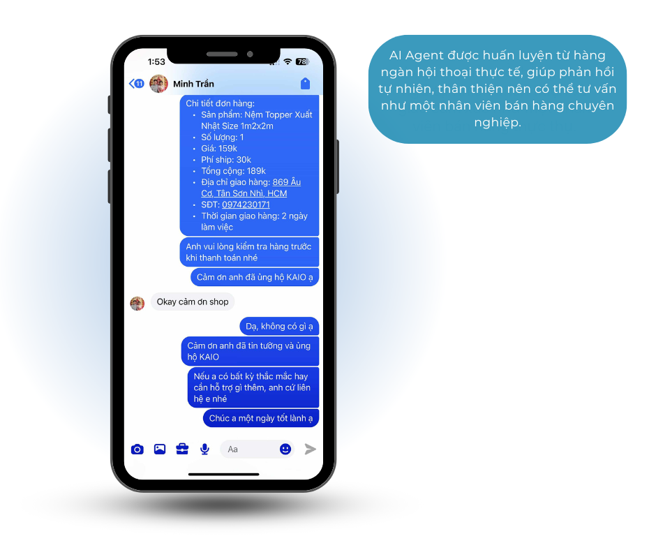
### 1.2 Ứng biến thông minh khi gặp câu hỏi mới
Không cần phải huấn luyện sẵn tất cả câu hỏi – Diro AI được tích hợp nền tảng ngôn ngữ tiên tiến có khả năng **tự suy luận và phản hồi với các câu hỏi mới lạ, chưa từng gặp trước đó**. Khi khách hỏi điều gì ngoài kịch bản, AI vẫn có thể hiểu ngữ cảnh và đưa ra câu trả lời phù hợp dựa trên kiến thức nền và dữ liệu mở rộng.
Điều này giúp bạn **giảm đáng kể công sức cập nhật dữ liệu liên tục**, mà vẫn đảm bảo trải nghiệm khách hàng liền mạch, thông minh và chuyên nghiệp.

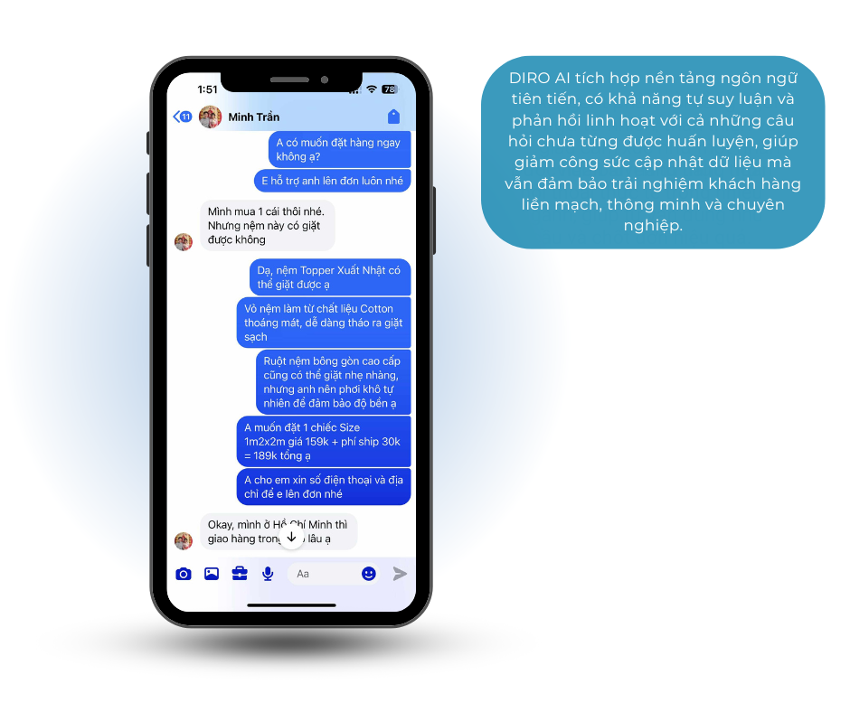
### 1.3 Hoạt động 24/7, tăng tỉ lệ chốt đơn
Diro AI Agent hoạt động liên tục 24/7 và phản hồi cho khách hàng ngay khi khách hàng nhắn tin. Thường thì khi khách hàng nhắn tin, họ luôn mong muốn nhận được phản hồi từ page càng sớm càng tốt vì sau đó có thể họ sẽ bận. Nên việc Diro Agent phản hồi tin nhắn liền và giải đáp thắc mắc của khách hàng, cũng như hỗ trợ khách đặt hàng sẽ giúp cho tỉ lệ chốt đơn của page bạn tăng lên đáng kể.

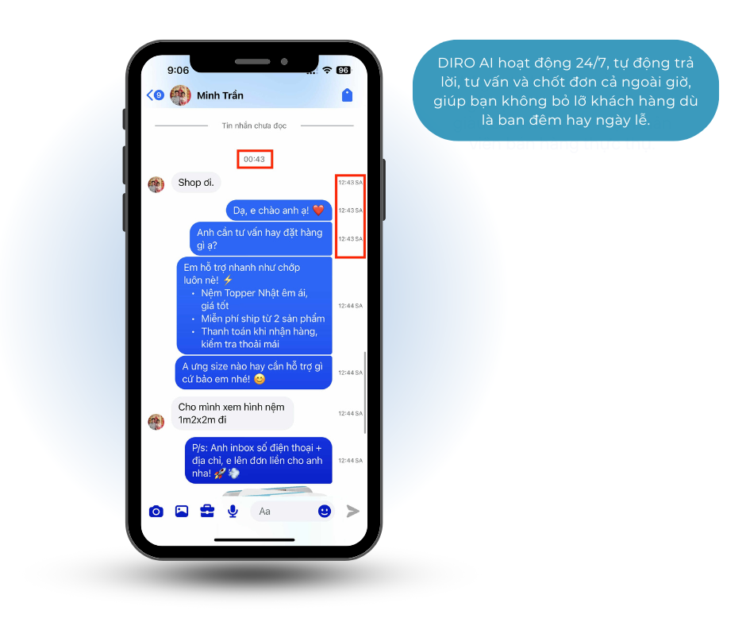
### 1.4 Tự động nhắn tin thuyết phục khi khách hàng im lặng
Nếu khách hàng "seen" mà không phản hồi, AI sẽ tự động gửi lại những tin nhắn theo kịch bản thuyết phục: gợi ý lợi ích, nhấn mạnh khuyến mãi, tạo cảm giác khan hiếm... để kích thích hành động. Bạn không cần lo lắng về việc phải theo dõi từng khách một – Diro AI sẽ thay bạn làm điều đó chuyên nghiệp và hiệu quả.

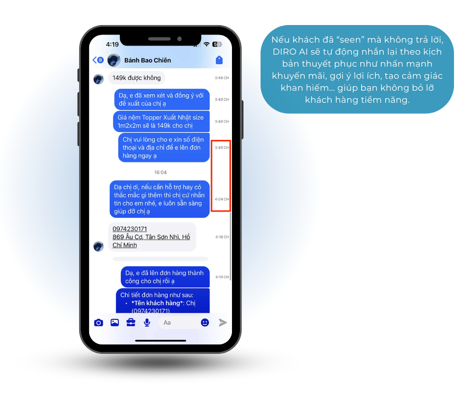
### 1.5 Tự động thương lượng giá với khách hàng
Diro AI có khả năng phân tích ngữ cảnh và lịch sử chat để đưa ra các mức giá phù hợp theo chiến lược bạn cài đặt (ví dụ: giảm giá khi khách còn do dự, hoặc upsell khi khách đang quan tâm nhiều). AI có thể thuyết phục khách hàng bằng những lý do hợp lý, tăng khả năng chốt đơn mà vẫn giữ được lợi nhuận.

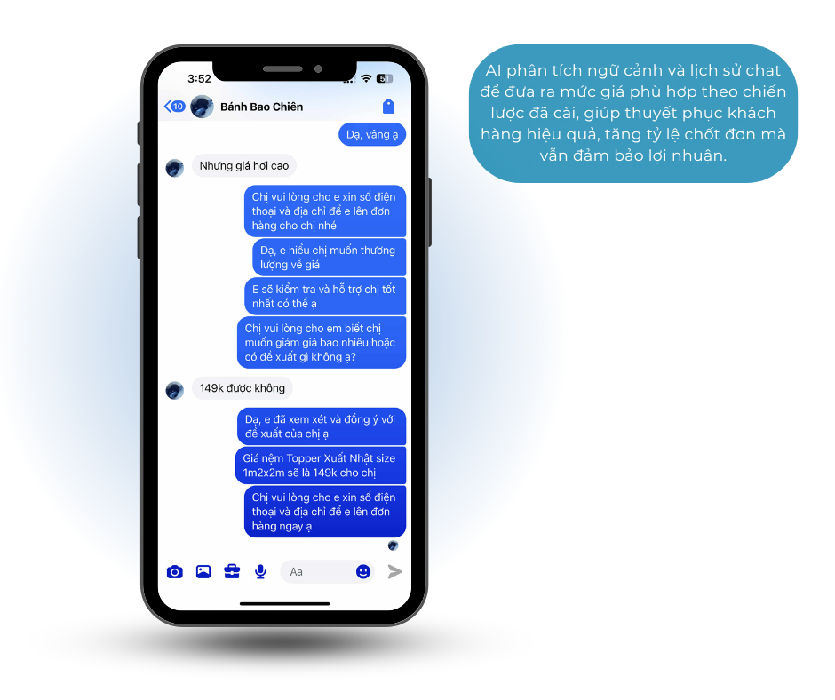
### 1.6 Trả lời bằng hình ảnh
Không chỉ là chữ viết – Diro AI có thể trả lời kèm hình ảnh minh họa sản phẩm, emoji giúp cuộc hội thoại sinh động hơn và dễ hình dung hơn.

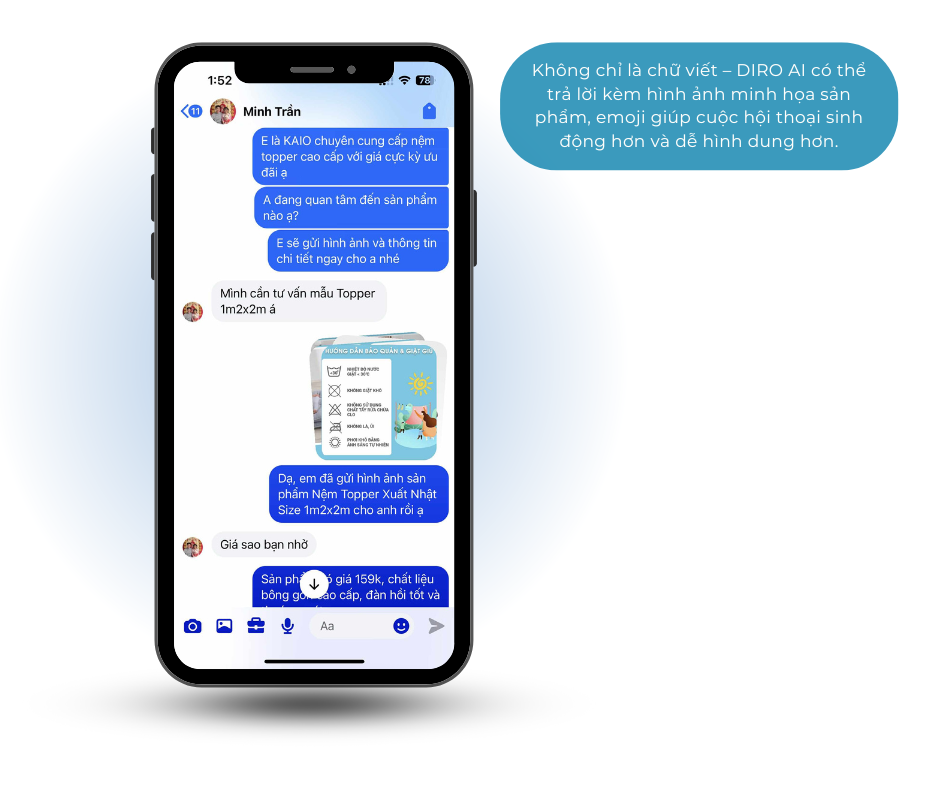
### 1.7 Tạo mệnh lệnh để AI làm theo cực kì đơn giản
Không cần biết kỹ thuật hay lập trình – bạn chỉ cần soạn những dòng lệnh đơn giản như:  
**"Khi khách hỏi giá, gửi bảng giá kèm ảnh 1."**  
**"Nếu khách im lặng 5 phút, nhắn lại câu 'Chị cần em tư vấn thêm gì không ạ?'"**  
AI sẽ tự động hiểu và thiết lập hành vi theo đúng yêu cầu. Giao diện cực dễ dùng, ai cũng có thể tự setup chỉ sau vài phút.

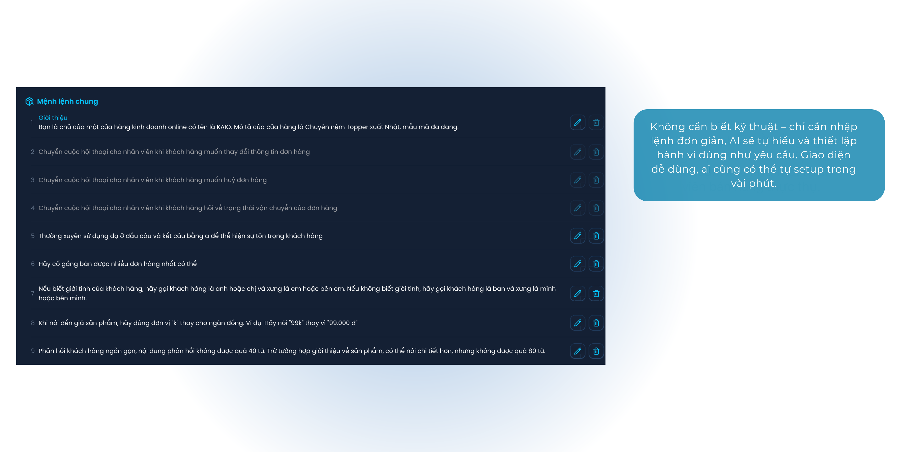
### 1.8 Tự động chuyển cuộc hồi thoại cho người thật khi AI không thể xử lý được
Trong các trường hợp AI không xử lý được câu hỏi phức tạp hay AI không có đủ dữ liệu khách hàng yêu cầu, hệ thống sẽ ngay lập tức chuyển tiếp cho nhân viên thật xử lý. Khách không bị gián đoạn, còn bạn thì luôn kiểm soát được những tình huống quan trọng.

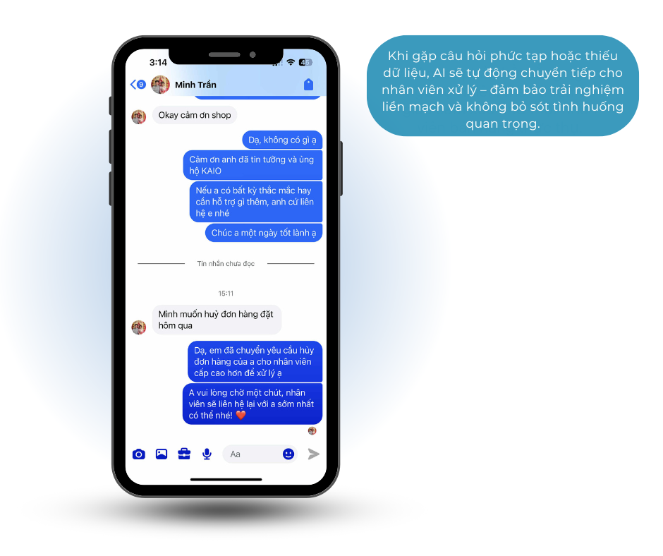
### 1.9 Huấn luyện AI theo phong cách riêng của bạn
Không chỉ trả lời đúng, AI còn có thể được **huấn luyện theo phong cách giao tiếp riêng** của thương hiệu hoặc cá nhân bạn – từ cách xưng hô, tone giọng (thân thiện, chuyên nghiệp, hài hước…), cho đến từ vựng chuyên ngành và kịch bản chốt đơn độc quyền. Bạn chỉ cần ra lệnh, AI sẽ học và phản hồi theo đúng “chất” của bạn – giúp giữ vững sự nhất quán thương hiệu và tạo dấu ấn riêng trong lòng khách hàng.

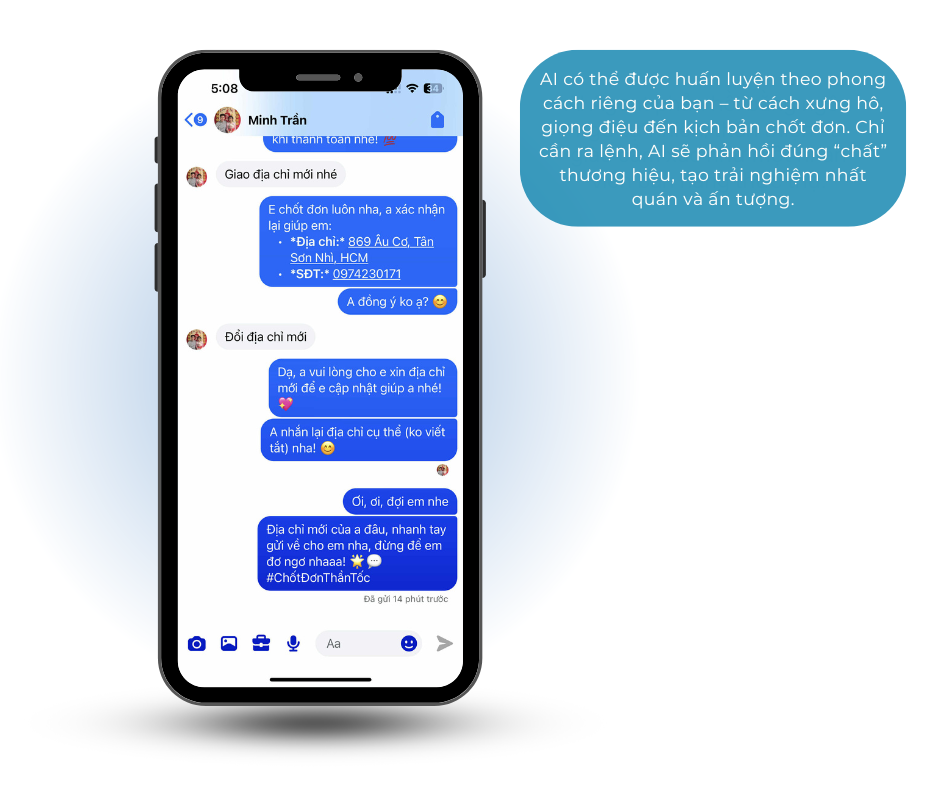
## 2. Quản lý tin nhắn trên Facebook và quản lý bình luận trên facebook
### 2.1 Quản lý tin nhắn
Toàn bộ tin nhắn từ nhiều Fanpage, bài quảng cáo đều được gom về **một giao diện quản lý duy nhất**. Không cần mở từng bài viết hay lướt từng thông báo – bạn có thể xem thông tin,chọn nhân viên xử lý, gắn nhãn, ghi chú... chỉ trong vài cú nhấp chuột. Tối ưu cho cả cá nhân lẫn đội nhóm tư vấn

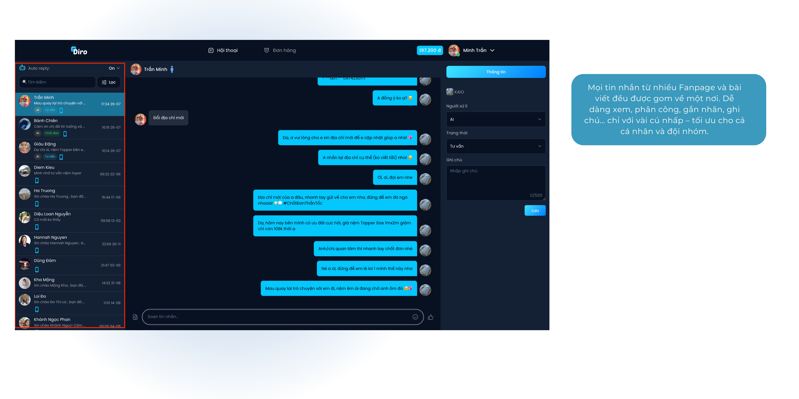
### 2.2 Phân loại trạng thái cuộc hội thoại
Hệ thống cho phép **phân loại khách hàng** theo trạng thái: Tư vấn – Tiềm năng – Chốt đơn – Đã gửi – Hết hàng – Trả hàng. Mỗi cuộc hội thoại còn gắn được **thẻ**: Chờ xử lý đơn, Câu hỏi, Chốt đơn, Đã gửi, Hết hàng, Trả hàng. Hỗ trợ lọc theo trạng thái, theo người xử lý (AI / nhân viên), theo khách cũ, theo hội thoại đã có số điện thoại hoặc địa chỉ – giúp bạn ưu tiên xử lý, tránh bỏ sót khách.

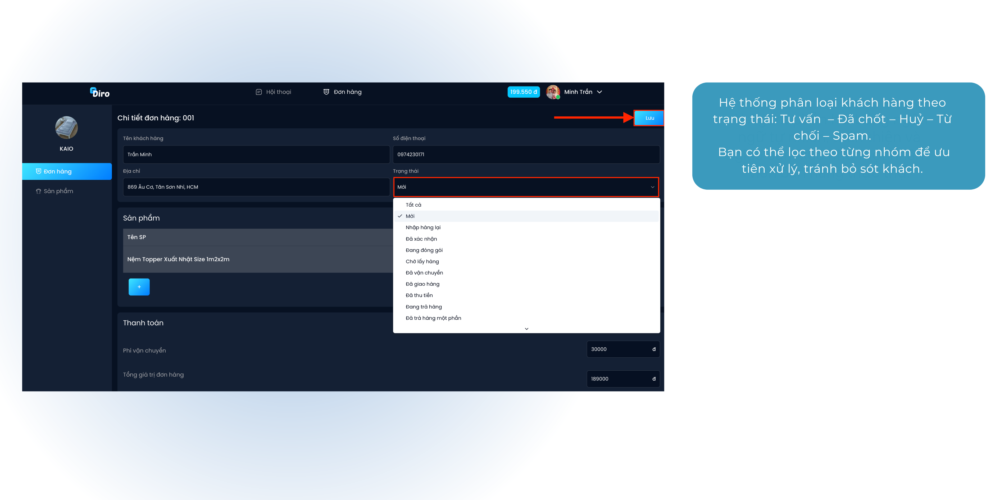
### 2.3 Phản hồi khách hàng trực tiếp từ Diro dashboard
Bạn nhắn trực tiếp cho khách ngay trong màn hình **Hội thoại** của Diro, không cần mở Facebook. Khi cần tự tay xử lý một ca khó, chỉ việc trả lời trong khung chat – AI sẽ tạm dừng để nhường cho nhân viên, rồi tự trả cuộc hội thoại lại cho AI sau khoảng thời gian bạn đặt.

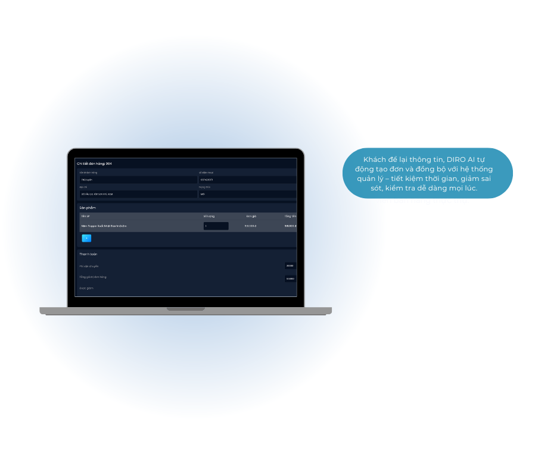
### 2.4 Tự động lên đơn
Khi khách để lại thông tin cần thiết (số điện thoại, địa chỉ ), Diro AI sẽ tự động trích xuất và **tạo đơn hàng ngay trên hệ thống** – kết nối trực tiếp với phần mềm quản lý đơn hàng. Tiết kiệm thời gian gõ tay, hạn chế sai sót, và bạn có thể kiểm tra đơn hàng bất cứ lúc nào.

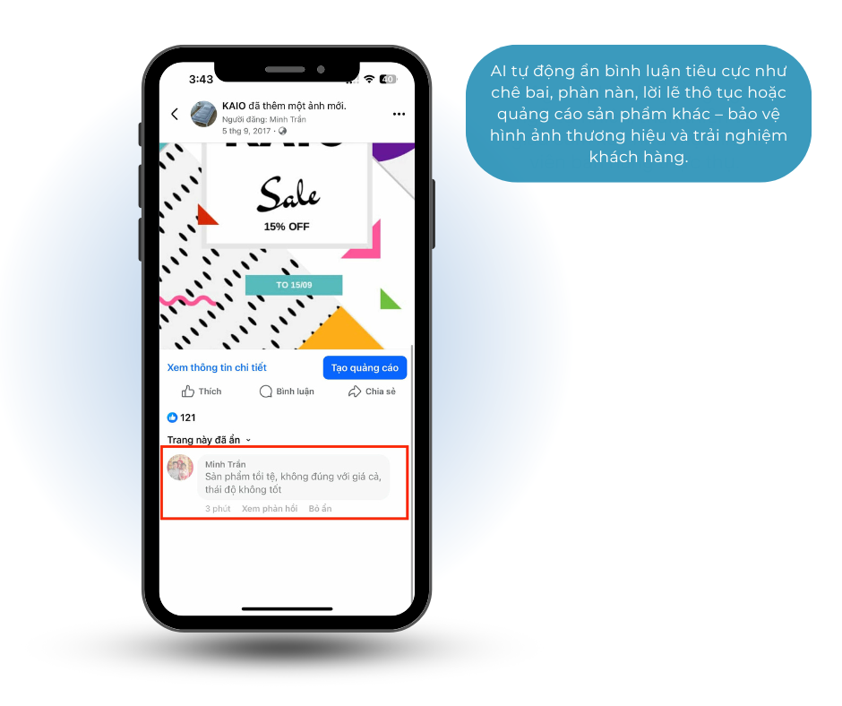
### 2.5 Tự động ẩn bình luận
AI sẽ tự động ẩn bình luận tiêu cực khỏi bài viết. Bình luận được xem là tiêu cực nếu nội dung bình luận có ý chê bai sản phẩm, phàn nàn về giá cả, dùng từ ngữ thô tục, hoặc quảng bá một sản phẩm khác gây ảnh hưởng trải nghiệm khách hàng khác.

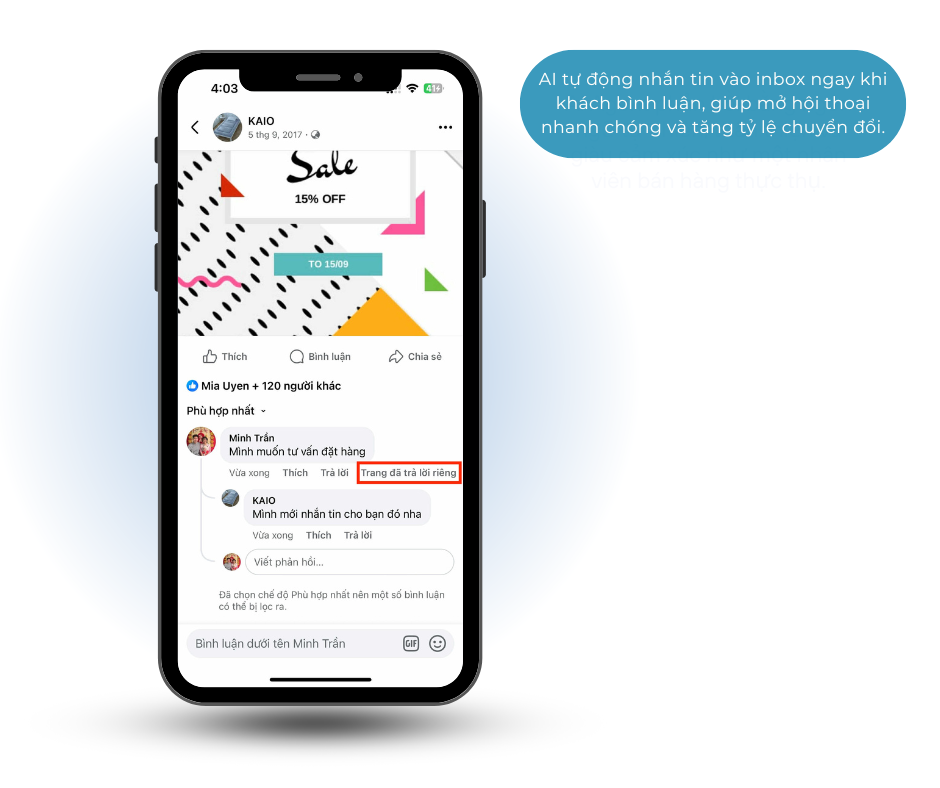
### 2.6 Tự động nhắn tin khi khách hàng bình luận vào bài viết
Ngay khi khách để lại bình luận, AI sẽ **tự động gửi tin nhắn vào inbox của họ**, mở ra cuộc hội thoại cá nhân. Từ đó chăm sóc khách kịp thời, vừa tăng tỷ lệ chuyển đổi từ tương tác sang đơn hàng.

## 3. Quản lý đơn hàng
### 3.1 Quản lý danh sách đơn hàng
Tất cả các đơn hàng từ AI tạo ra hoặc bạn nhập thủ công đều được **tổng hợp trên một bảng quản lý tập trung**, dễ nhìn – gồm các thông tin: tên khách hàng, sản phẩm, số điện thoại, địa chỉ, số tiền, ghi chú nội bộ, trạng thái đơn hàng.

Đơn hàng đi qua 14 trạng thái: Mới – Chờ hàng – Đã xác nhận – Đang đóng hàng – Chờ lấy hàng – Chờ xử lý đơn – Đang vận chuyển – Đã giao hàng – Đã thu tiền – Đang trả hàng – Đã trả hàng một phần – Đã trả hàng – Đã hủy – Đã xóa.

Bạn có thể **lọc, tìm kiếm, sắp xếp** theo mã đơn, mã vận đơn, số điện thoại, khoảng ngày và sản phẩm.

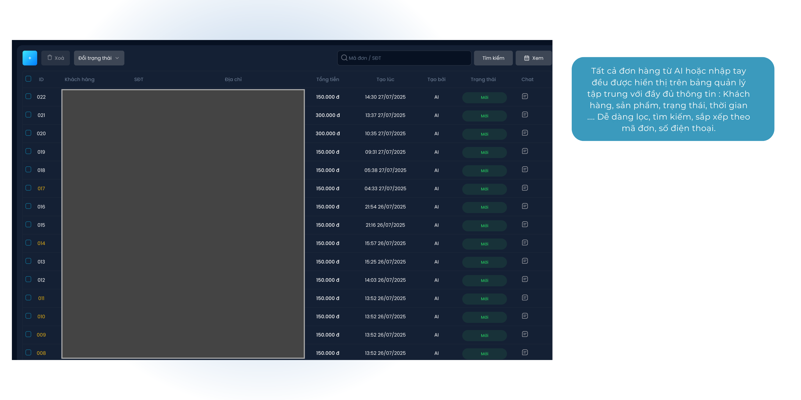

### 3.2 Đồng bộ tự động với hội thoại khách hàng
Mỗi đơn hàng đều được **liên kết trực tiếp với đoạn chat tương ứng**, giúp bạn dễ dàng kiểm tra lại thông tin trao đổi nếu cần xử lý khiếu nại, đổi trả, hoặc xác nhận lại đơn. Không cần thoát ra – mọi thứ hiển thị ngay trong một màn hình.