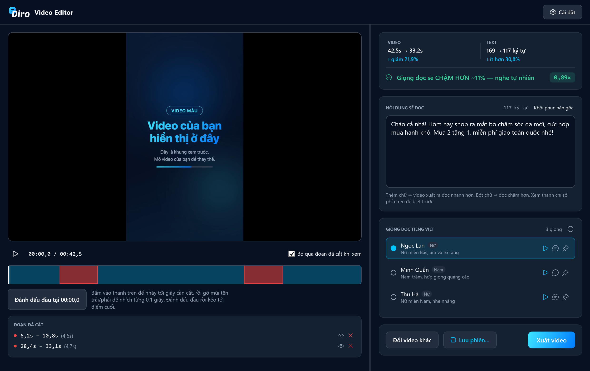
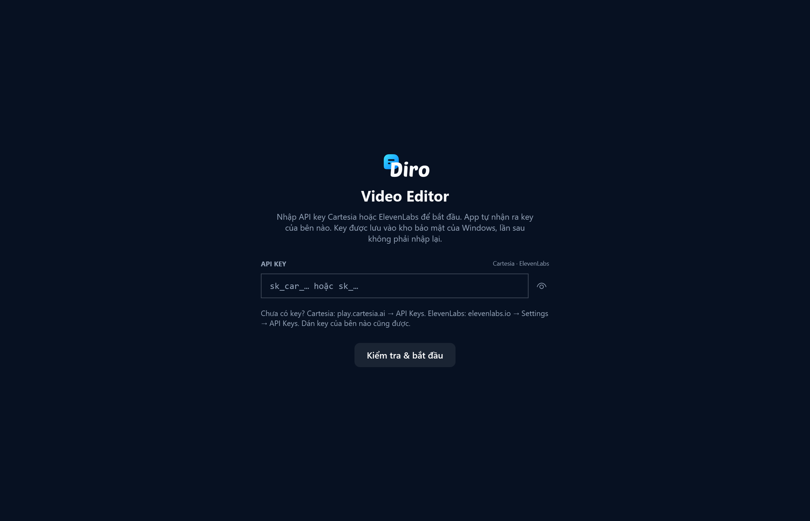
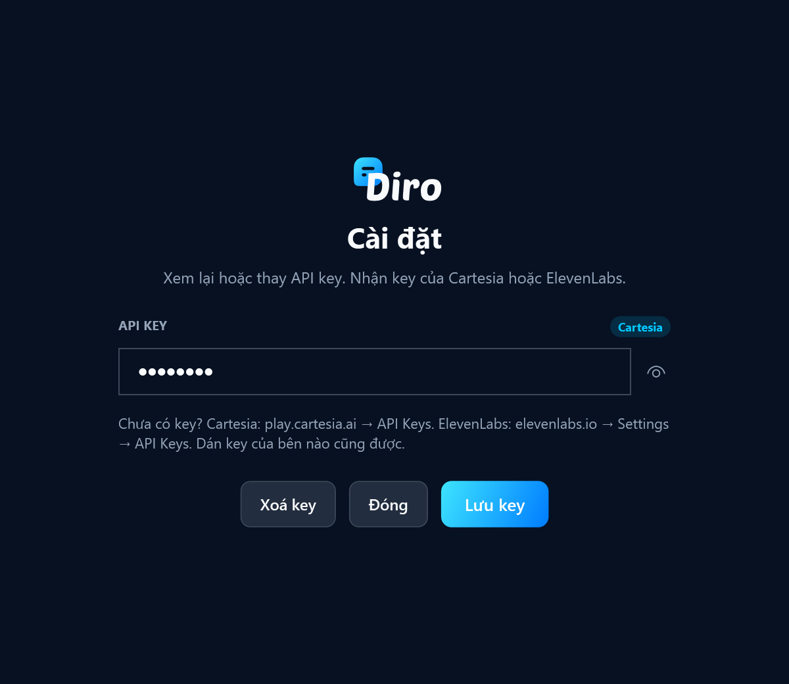
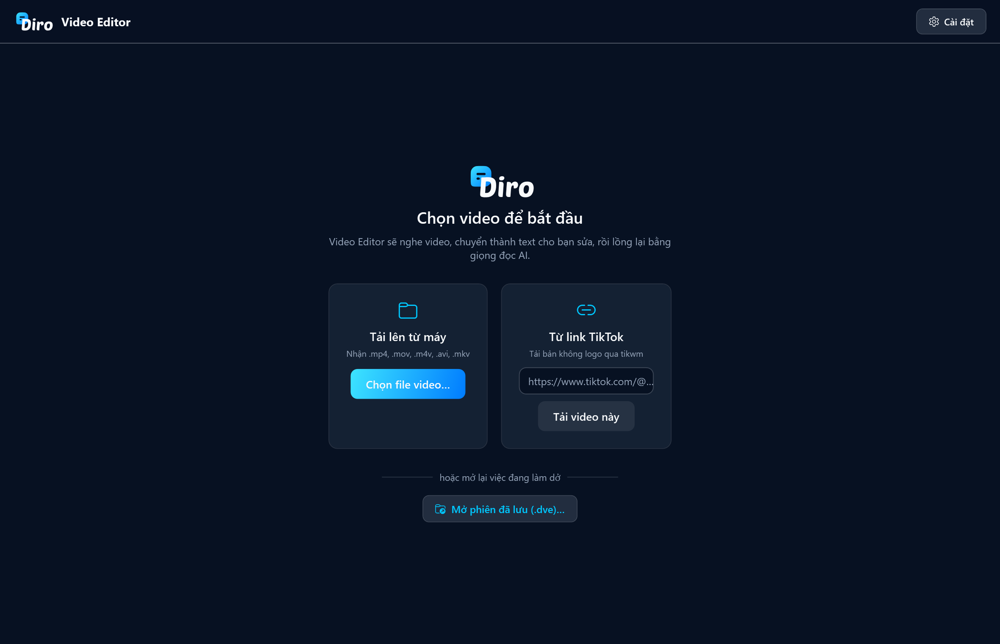
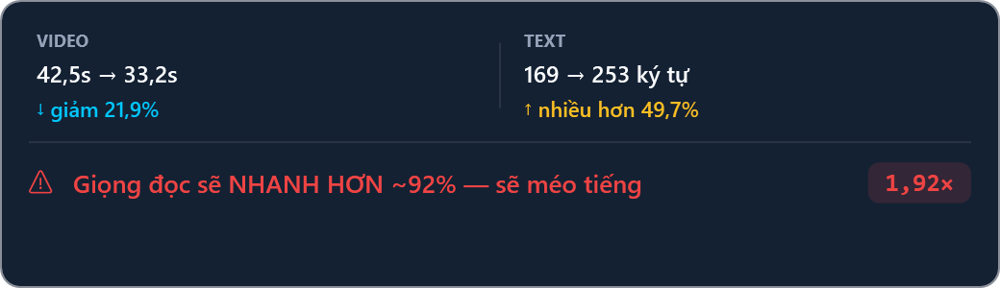

# 🎬 Công cụ chỉnh sửa video (Diro Video Editor)

**Diro Video Editor** là phần mềm cài trên máy tính, giúp bạn **thay giọng đọc
của một video** chỉ trong vài phút.

Bạn đưa video vào — từ file trên máy hoặc dán link TikTok. Phần mềm tự **nghe
video và gõ ra thành chữ**. Bạn sửa lại lời thoại tuỳ ý, cắt bớt đoạn thừa, chọn
một giọng đọc tiếng Việt, rồi bấm xuất. Video mới giữ nguyên hình ảnh nhưng lời
đọc là hoàn toàn mới.

:::tip Điều đặc biệt nhất

**Lời đọc luôn dài đúng bằng video.** Bạn không phải căn chỉnh gì cả:

- Bạn **thêm chữ** vào → video xuất ra sẽ **đọc nhanh hơn** cho vừa
- Bạn **bớt chữ** đi → video sẽ **đọc chậm lại**
- Bạn **cắt bớt video** → lời đọc dồn vào khoảng thời gian ngắn hơn, tức là nhanh hơn

Thanh chỉ số ở góc trên bên phải cho bạn biết trước tốc độ đọc sẽ là bao nhiêu,
**trước khi** bạn tốn tiền gọi API.
:::

---

## 📥 Bước 1: Tải phần mềm về máy

| Máy của bạn | Bấm để tải | Sau khi tải xong |
|---|---|---|
| **Windows 10 / 11** | **[⬇️ TẢI CHO WINDOWS](https://github.com/nhatduy129/diro-video-editor/releases/download/v1.0.0/DiroVideoEditor-1.0.0-win-x64.zip)** `DiroVideoEditor-1.0.0-win-x64.zip` · ≈104 MB | **Giải nén** rồi bấm đúp `DiroVideoEditor.exe` — **không cần cài đặt** |
| **macOS 14 trở lên** | **[⬇️ TẢI CHO macOS](https://github.com/nhatduy129/diro-video-editor/releases/download/v1.0.0/DiroVideoEditor-1.0.0-macos.zip)** `DiroVideoEditor-1.0.0-macos.zip` · ≈1 MB | **Giải nén** rồi kéo `Video Editor.app` vào thư mục **Applications** |

Số `1.0.0` trong tên file là **phiên bản** — bạn nhìn tên file là biết mình đang
giữ bản nào. Xem các bản phát hành khác tại
[trang Releases](https://github.com/nhatduy129/diro-video-editor/releases).

:::note Cách giải nén
**Windows**: bấm chuột phải vào file `.zip` → **Extract All…** → **Extract**.
Nhớ giải nén ra rồi mới chạy — chạy thẳng từ trong file nén sẽ lỗi.

**macOS**: bấm đúp vào file `.zip` là tự giải nén.
:::

:::warning Lần đầu mở máy có thể cảnh báo — đây là bình thường

Phần mềm chưa mua chứng chỉ ký số nên hệ điều hành chưa "quen mặt":

**Trên Windows** — hiện bảng xanh *"Windows protected your PC"*:
🔹 Bấm **More info** → 🔹 Bấm **Run anyway**

**Trên macOS** — báo *"không mở được vì chưa xác minh nhà phát triển"*:
🔹 Bấm **chuột phải** vào app → 🔹 Chọn **Open** → 🔹 Bấm **Open** lần nữa

Chỉ phải làm một lần duy nhất. Các lần sau mở bình thường.
:::

:::info Trong file zip bản Windows có gì
- `DiroVideoEditor.exe` — phần mềm, bấm đúp là chạy
- `HUONG-DAN.txt` — tóm tắt vài dòng cách mở lần đầu
- `FFMPEG-LICENSE.txt` — giấy phép của bộ xử lý video đi kèm
:::

:::note Vì sao file Windows nặng như vậy?
Vì phần mềm đóng gói sẵn **mọi thứ cần thiết** vào trong một file duy nhất, để
bạn tải về là chạy được ngay mà không phải cài thêm bất cứ thứ gì. Lần chạy đầu
tiên hơi lâu vài giây vì máy đang bung bộ xử lý video ra; những lần sau mở nhanh.
:::

---

## 🔑 Bước 2: Lấy API key Cartesia

Phần mềm dùng dịch vụ **Cartesia** để nghe video và tạo giọng đọc. Bạn cần một
API key riêng của mình — key này gắn với tài khoản của bạn, và chi phí đọc tính
vào tài khoản đó.

🔹 **Bước 2.1** — Vào [play.cartesia.ai](https://play.cartesia.ai) và **đăng ký
tài khoản** (đăng nhập bằng Google cho nhanh).

🔹 **Bước 2.2** — Vào thẳng trang [play.cartesia.ai/keys](https://play.cartesia.ai/keys).

🔹 **Bước 2.3** — Bấm nút **Create API Key**, đặt tên bất kỳ (ví dụ `Diro Video Editor`).

🔹 **Bước 2.4** — Cartesia hiện ra một chuỗi bắt đầu bằng `sk_car_…`.
**Sao chép ngay lúc đó** — đóng cửa sổ đi là không xem lại được nữa, phải tạo key mới.

🔹 **Bước 2.5** — Mở Diro Video Editor, dán key vào ô rồi bấm **Kiểm tra & bắt đầu**.

Phần mềm sẽ **kiểm tra key với Cartesia trước khi lưu**, nên nếu bạn dán nhầm
hoặc thiếu ký tự thì nó báo ngay chứ không để bạn làm tiếp rồi mới hỏng.

:::info Key của bạn được cất ở đâu?
Key được lưu vào **kho bảo mật của hệ điều hành** (Keychain trên macOS, DPAPI
trên Windows), mã hoá theo tài khoản máy của bạn — không nằm trần trong file cấu
hình nào. Lần sau mở phần mềm không phải nhập lại.

Muốn đổi hoặc xoá key: bấm nút **Cài đặt** ở góc trên bên phải.
:::

### 💰 Chi phí khoảng bao nhiêu?

Cartesia tính theo **credit**. Ước lượng cho dễ hình dung:

| Việc | Cách tính |
|---|---|
| Nghe video → ra chữ | 1 credit cho mỗi 2 giây video |
| Tạo giọng đọc | khoảng 1 credit cho mỗi ký tự |

Một video 60 giây với lời đọc 700 chữ tốn khoảng **730 credit**. Mỗi gói của
Cartesia đều tặng sẵn một lượng credit hằng tháng. Xem mình đã dùng bao nhiêu
tại [play.cartesia.ai/usage](https://play.cartesia.ai/usage).

:::tip Nghe thử không tốn tiền
Trong danh sách giọng đọc, nút ▷ là **nghe mẫu có sẵn của Cartesia — miễn phí**.
Nút 💬 bên cạnh mới là đọc thử chính nội dung của bạn, cái này có tính phí (rất nhỏ).
:::

---

## 🎥 Bước 3: Đưa video vào

Có hai cách:

**Cách 1 — Tải lên từ máy.** Bấm **Chọn file video…** rồi chọn file. Nhận các
định dạng `.mp4`, `.mov`, `.m4v`, `.avi`, `.mkv`.

**Cách 2 — Từ link TikTok.** Dán link vào ô rồi bấm **Tải video này**. Phần mềm
tải về **bản không có logo TikTok**.

:::tip Dán nguyên câu chia sẻ cũng được
Nút Chia sẻ của TikTok chép ra cả câu mô tả dài kèm link. Bạn cứ dán nguyên vào,
phần mềm tự nhặt link ra — không cần cắt gọn.
:::

Sau khi có video, phần mềm mất một lúc để **nghe và gõ lại thành chữ**. Video
càng dài càng lâu, thường vài chục giây.

---

## ✏️ Bước 4: Sửa lời thoại

Nội dung nghe được hiện ở ô **NỘI DUNG SẼ ĐỌC** bên phải. Bạn sửa thoải mái:
viết lại cho hay hơn, đổi tên sản phẩm, thêm lời kêu gọi mua hàng, hoặc **xoá
hết gõ lại từ đầu** cũng được.

Bấm **Khôi phục bản gốc** nếu muốn quay lại nội dung ban đầu.

:::caution Nhớ nhìn thanh chỉ số
Sửa tới đâu, thanh chỉ số phía trên đổi tới đó. Đây là chỗ cho bạn biết giọng
đọc sắp tới nghe có tự nhiên không.
:::

---

## ✂️ Bước 5: Cắt bớt đoạn thừa

🔹 Bấm vào **thanh thời gian** để nhảy tới giây cần cắt
🔹 Bấm **Đánh dấu đầu tại …**
🔹 Kéo hoặc bấm tiếp tới điểm cuối
🔹 Bấm **✂ Cắt đoạn này**

Đoạn bị cắt hiện **màu đỏ** trên thanh thời gian và liệt kê ở mục **ĐOẠN ĐÃ CẮT**
bên dưới. Bấm 👁 để xem lại đoạn đó, bấm ✕ để bỏ cắt.

Tích sẵn ô **Bỏ qua đoạn đã cắt khi xem** để lúc xem trước, phần mềm tự nhảy qua
những đoạn bạn đã bỏ — xem đúng như bản cuối cùng.

:::note Cắt video KHÔNG tự xoá chữ tương ứng
Đây là cố ý, để bạn tự quyết định giữ hay bỏ câu nào. Cắt xong nhớ ngó lại ô nội
dung xem có cần bớt chữ không.
:::

---

## 🎙️ Bước 6: Chọn giọng đọc

Danh sách chỉ hiện **giọng tiếng Việt**. Mỗi dòng có tên giọng, nhãn Nam/Nữ và
mô tả ngắn.

- Bấm **▷** để nghe mẫu có sẵn (miễn phí)
- Bấm **💬** để nghe giọng đó đọc chính nội dung của bạn (tốn rất ít)
- Bấm vào dòng để chọn

---

## 📊 Hiểu thanh chỉ số

Đây là phần đáng để ý nhất của phần mềm.

| Màu | Ý nghĩa | Nên làm gì |
|---|---|---|
| 🟢 **Xanh** — nghe tự nhiên | Tốc độ trong khoảng 0,85× – 1,20× | Cứ xuất video |
| 🟡 **Vàng** — hơi gượng | 0,70× – 1,50× | Vẫn nghe được, nhưng đã thấy nhanh/chậm |
| 🔴 **Đỏ** — sẽ méo tiếng | Ngoài khoảng trên | Nên sửa lại trước khi xuất |

**Gặp màu đỏ thì làm gì?**

- Giọng đọc **quá nhanh** → bớt chữ đi, hoặc bớt cắt video lại
- Giọng đọc **quá chậm** → thêm chữ vào, hoặc cắt bớt video

---

## 💾 Bước 7: Xuất video

Bấm **Xuất video**, chọn chỗ lưu. Phần mềm sẽ tạo giọng đọc, co cho khớp đúng
thời lượng, rồi ghép với hình.

Xong, nó báo cho bạn biết giọng đọc đã chạy ở tốc độ bao nhiêu, ví dụ
*"giọng đọc chạy ở 0,89× so với bình thường"*.

:::info Tiếng gốc của video bị thay hoàn toàn
Video xuất ra **chỉ còn giọng đọc mới**, không còn tiếng gốc và cũng không có
nhạc nền của video cũ. Muốn có nhạc nền thì ghép thêm ở phần mềm khác.
:::

---

## 📁 Lưu việc đang làm dở

Làm nửa chừng mà phải tắt máy? Bấm **Lưu phiên…** để lưu ra file `.dve`. File
này gói **cả video, nội dung chữ, các đoạn đã cắt và giọng đang chọn**.

Hôm sau mở phần mềm, bấm **Mở phiên đã lưu (.dve)…** là làm tiếp đúng chỗ cũ.

| Phím tắt | Việc |
|---|---|
| `Ctrl + S` (Mac: `⌘S`) | Lưu phiên |
| `Ctrl + Shift + S` (Mac: `⇧⌘S`) | Lưu thành file khác |
| `Ctrl + O` (Mac: `⌘O`) | Mở phiên đã lưu |

:::tip File lưu ở máy Windows mở được trên máy Mac
Hai bản dùng chung một định dạng file, nên bạn lưu ở máy bàn Windows rồi mở
trên MacBook vẫn chạy bình thường.
:::

---

## ❓ Gặp trục trặc

**Dán link TikTok mà báo link không mở được**
Link rút gọn đã hết hạn hoặc video bị gỡ. Mở lại video trên TikTok → **Chia sẻ**
→ **Sao chép liên kết**, rồi dán lại. Video ở chế độ riêng tư thì không tải được.

**Báo "API key không hợp lệ"**
Key bị thiếu ký tự lúc sao chép, hoặc đã bị xoá bên Cartesia. Tạo key mới tại
[play.cartesia.ai/keys](https://play.cartesia.ai/keys) rồi vào **Cài đặt** dán lại.

**Nghe không ra chữ, ô nội dung để trống**
Video không có tiếng, hoặc tiếng quá nhỏ / lẫn nhiều tạp âm. Bạn vẫn **tự gõ nội
dung vào ô** rồi làm tiếp bình thường.

**Khung xem trước bị đen nhưng vẫn bấm được các nút**
Windows thiếu bộ giải mã cho định dạng video đó. Chỉ ảnh hưởng phần **xem trước**
— bạn vẫn cắt và xuất video được bình thường.

**Xuất video xong thấy hết credit**
Xem mức dùng tại [play.cartesia.ai/usage](https://play.cartesia.ai/usage) và
nâng gói tại [play.cartesia.ai/subscription](https://play.cartesia.ai/subscription).

---

## 📌 Cần chuẩn bị những gì

- Máy **Windows 10/11** hoặc **macOS 14** trở lên
- Một tài khoản **Cartesia** (đăng ký miễn phí) để lấy API key
- Kết nối mạng khi nghe video và khi tạo giọng đọc
